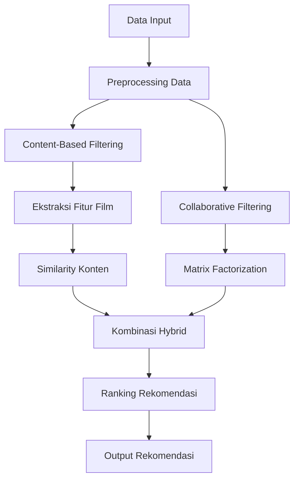
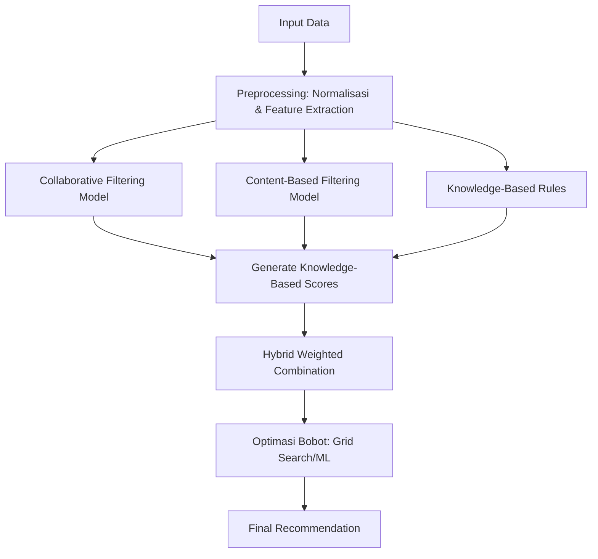
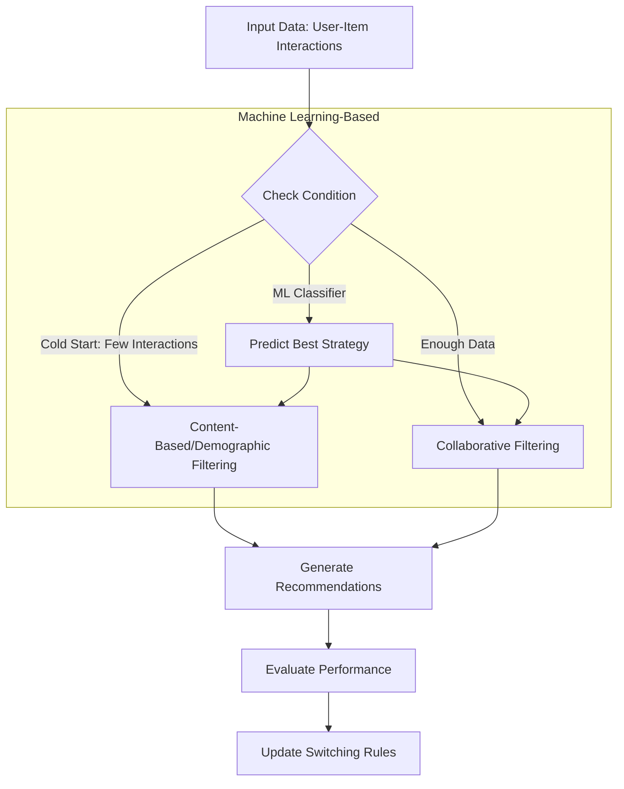
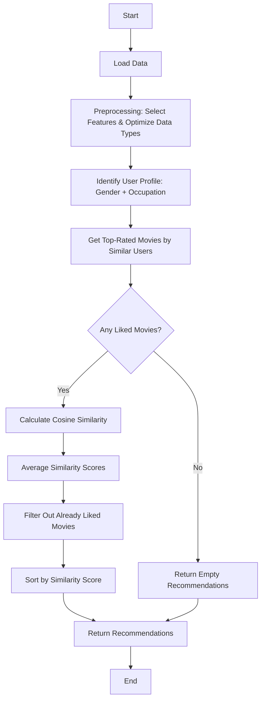
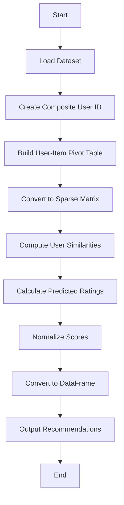

# Laporan Proyek Machine Learning -Ibrahim Akbar Arsanata

# Project Overview

Era digital ditandai dengan **information overload** yang membutuhkan cara penemuan kembali informasi yang efektif. Sistem rekomendasi muncul sebagai solusi untuk memberikan rekomendasi personal kepada pengguna sesuai preferensi mereka di tengah banjirnya informasi digital.[^1]  

Kemampuan untuk menyaring informasi dan menyajikan konten yang paling relevan bagi pengguna tidak hanya meningkatkan kepuasan pengguna tetapi juga menjadi faktor kunci dalam kesuksesan bisnis digital.
Berikut pengaruh **Kualitas dan Relevansi Konten**:  
  - Faktor kunci dalam membangun citra dan reputasi institusi.  
  - Meningkatkan pengalaman audiens, membangun kredibilitas, serta memperkuat komunikasi.  
  - Strategi penentuan relevansi yang meliputi Analisis audiens dan penelitian pasar dan Penyampaian pesan sesuai kebutuhan dan preferensi pengguna  
  - Konten penting yang kurang populer harus disajikan secara menarik untuk dampak positif.[^2]

Tak hanya itu **Pengalaman Pengguna** juga berperan sangat penting seperti: 
  - Berperan penting dalam membentuk citra positif layanan elektronik.  
  - Menciptakan loyalitas, meningkatkan kepuasan, dan kepercayaan pengguna. 
  - Pengalaman buruk dapat menyebabkan frustrasi dan migrasi pengguna ke platform lain.[^3]  

Tidak berbeda jauh, industri film juga menghadapi tantangan besar dalam menghadirkan konten yang sesuai dengan preferensi beragam pengguna. Perilaku konsumsi media menimbulkan tantangan utama dalam distribusi dan eksibisi, seperti:

1. **Distribusi Tidak Merata**:  
   - Bioskop dan layar terpusat di kota besar.  
   - Dominasi film asing (terutama Hollywood) di bioskop dan produksi.  

2. **Persaingan Ketat**:  
   - Maraknya platform digital (Netflix, Viu) yang agresif mendistribusikan film secara global.  
   - Film nasional sulit mendapatkan penonton meski mendapat slot layar besar.  

3. **Kebutuhan Adaptasi**:  
   - Penyeimbangan distribusi konvensional (bioskop) dan digital.  
   - Strategi distribusi adaptif dan dukungan kebijakan pemerintah (misalnya insentif pajak untuk film kurang diminati).
  
**Tantangan terbesar**: Bukan hanya ketersediaan layar, tetapi bagaimana menghadirkan konten relevan yang mudah diakses oleh audiens beragam, baik melalui bioskop maupun platform digital.[^4]  

Selain itu Cold start menjadi tantangan utama dalam industri film dengan dampak:  

- **Pengguna Baru**:  
  - Rekomendasi tidak personal, mengurangi retensi pengguna.  
- **Film Baru**:  
  - Minim eksposur, kurang kompetitif di pasar.  
- **Platform Streaming**:  
  - Risiko kehilangan pelanggan jika rekomendasi awal tidak menarik.[^5]
 
Untuk mengatasi hal tersebut dapat digunakan sistem hyrbid yang menggabungkan **Collaborative Filtering** (berbasis interaksi pengguna) dan **Content-Based Filtering** (berbasis metadata film seperti genre, sutradara, atau aktor).  Metode ini mampu memberikan rekomendasi awal untuk pengguna atau film baru dengan memanfaatkan kesamaan konten.[^6]  


# Busines Understanding

## Problem Statement
Tantangan utama yang diidentifikasi dalam industri film dan sistem rekomendasi:

1. **Overload Informasi dan Relevansi Konten**
   - Banjir informasi digital menyulitkan pengguna menemukan konten film yang relevan
   - Sistem konvensional sering gagal menampilkan konten berkualitas yang kurang populer

2. **Distribusi dan Aksesibilitas Film Tidak Merata**
   - Dominasi film asing dan distribusi bioskop tidak seimbang membatasi jangkauan film lokal/nasional
   - Minimnya layar bioskop di daerah non-urban memperparah masalah ini

3. **Masalah Cold Start**
   - Pengguna baru: Sistem tidak bisa memberikan rekomendasi personal karena kurangnya data interaksi
   - Film baru: Minim eksposur karena algoritma lebih memprioritaskan konten populer

4. **Persaingan dengan Platform Digital Global**
   - Platform streaming (Netflix, Viu) mendominasi dengan konten global, menyisihkan film lokal

5. **Pengalaman Pengguna (UX) yang Buruk**
   - Rekomendasi tidak akurat/tidak personal menurunkan kepuasan dan meningkatkan churn rate

## Goals
Target proyek untuk menjawab permasalahan di atas:

1. **Membangun Sistem Rekomendasi Hybrid**
   - Menggabungkan collaborative + content-based filtering untuk meningkatkan akurasi, khususnya bagi pengguna/film baru

2. **Meningkatkan Aksesibilitas Konten Lokal/Nasional**
   - Mengoptimalkan rekomendasi film lokal menggunakan metadata (genre, sutradara, bahasa)

3. **Mempersonalisasi Pengalaman Pengguna**
   - Menganalisis preferensi pengguna (riwayat tonton, rating) untuk mengurangi overload informasi

4. **Strategi Distribusi Digital-Konvensional**
   - Mengintegrasikan data bioskop dan streaming untuk rekomendasi multi-saluran

5. **Mengurangi Tingkat Churn Platform**
   - Meningkatkan retensi pengguna dengan rekomendasi onboarding yang lebih relevan

## Penyelarasan Masalah-Tujuan

| Pernyataan Masalah               | Tujuan                                 |
|----------------------------------|----------------------------------------|
| Overload informasi              | Sistem rekomendasi hybrid              |
| Distribusi tidak merata          | Fokus pada konten lokal/nasional       |
| Masalah cold start               | Gabungkan metadata + interaksi pengguna|
| Persaingan platform digital      | Rekomendasi multi-saluran              |
| UX buruk                         | Personalisasi berbasis preferensi      |

## Solution Statements

### 1. Hybrid Mixed (Kombinasi Beberapa Strategi)

Solusi hybrid dikembangkan untuk mengatasi tantangan spesifik dalam sistem rekomendasi film dengan memanfaatkan keunggulan dua pendekatan utama: Collaborative Filtering dan Content-Based Filtering. Pendekatan ini dirancang khusus untuk dataset yang mencakup:

- **Data pengguna**: rating, timestamp, usia, gender, pekerjaan
- **Data film**: judul, tahun rilis, 19 genre berbeda
- **Interaksi**: riwayat rating pengguna

### Alur Kerja Algoritma



- **Keunggulan Performa**

| **Keunggulan**               | **Penjelasan**                                                                 |
|------------------------------|-------------------------------------------------------------------------------|
| **Penanganan Cold Start**    | ✔ **Pengguna baru:** Rekomendasi berbasis demografi<br>✔ **Item baru:** Pendekatan similarity konten |
| **Personalisasi Multidimensi** | ✔ Gabungan preferensi implisit & eksplisit<br>✔ Skor hybrid untuk rekomendasi seimbang |
| **Optimalisasi Fitur**       | ✔ Memanfaatkan **19 kategori genre**<br>✔ Pengolahan data demografi tingkat lanjut |

- **Keterbatasan**

```diff
### Kompleksitas Komputasi:
+ Membutuhkan penyimpanan matriks embedding
+ Infrastruktur pelatihan dua model terpisah

### Penyempurnaan Bobot:
! Rasio 60:40 membutuhkan validasi empiris
! Sensitif terhadap perubahan distribusi data

### Ketergantungan Metadata:
# Performa menurun jika metadata tidak lengkap
# Tag genre/demografi harus terus diperbarui
```

### 2. Hybrid Weighted (Gabungan Numerik dengan Bobot)

Untuk membangun sistem rekomendasi yang akurat dan personalisasi, kami mengusulkan pendekatan **Hybrid Weighted** yang menggabungkan keunggulan Collaborative Filtering (CF), Content-Based Filtering (CBF), dan Knowledge-Based recommendations. Teknik ini memanfaatkan dataset pengguna (*user_id, rating, age, gender, occupation*) dan item (*movie_title, genre_0 hingga genre_18*) untuk menghasilkan rekomendasi yang lebih relevan.

---

## Workflow Algoritma/Pendekatan
Berikut alur kerja hybrid weighted approach dalam bentuk flowchart:



- **Kelebihan**

- **Kombinasi Fleksibel**: Bobot masing-masing metode (CF, CBF, Knowledge-Based) dapat disesuaikan berdasarkan performa.  
- **Optimasi Otomatis**: Bobot (w1, w2, w3) dioptimasi menggunakan Grid Search atau model Ensemble Learning (XGBoost/Random Forest).  
- **Personalisasi Lebih Baik**: Memanfaatkan fitur demografik (*age, gender, occupation*) dan genre film untuk rekomendasi yang lebih kontekstual.  
- **Handles Cold Start**: Knowledge-Based rules membantu ketika data rating terbatas.  

- **Kekurangan** 

- **Kompleksitas Komputasi**: Membutuhkan lebih banyak sumber daya untuk menjalankan multiple model sekaligus.  
- **Tuning Bobot**: Proses optimasi bobot bisa menjadi *trial-and-error* tanpa dataset validasi yang representatif.  
- **Ketergantungan Data**: Kualitas genre (*kategori one-hot-encoded*) sangat memengaruhi performa CBF.  

### 3. Hybrid Switching (Bergantung Kondisi)

Untuk mengatasi masalah cold start dan memaksimalkan akurasi rekomendasi, pendekatan Hybrid Switching secara dinamis memilih strategi terbaik berdasarkan kondisi data pengguna/item. Teknik ini menggabungkan Collaborative Filtering (CF), Content-Based Filtering (CBF), dan Demographic Filtering dengan mekanisme switching yang ditentukan oleh rule-based atau machine learning.


- **Kelebihan**

- **Adaptif**: Secara otomatis beralih ke metode yang paling sesuai (misal: CBF untuk pengguna baru).  
- **Mengatasi Cold Start**: Rule-based switching memastikan rekomendasi tetap relevan meski data terbatas.  
- **Optimasi Dinamis**: Jika menggunakan ML-based switching, model dapat belajar dari pola pengguna untuk memilih strategi terbaik.  
- **Efisiensi Sumber Daya**: Hanya menjalankan satu metode yang diperlukan pada setiap kasus.  

- **Kekurangan** 

- **Ketergantungan pada Threshold**: Rule-based membutuhkan definisi jelas untuk "cukup data" (misal: minimal 5 rating).  
- **Kompleksitas Model ML**: Klasifikasi untuk memilih strategi memerlukan pelatihan dan fitur tambahan.  
- **Risk of Over-Engineering**: Jika kondisi terlalu sederhana, pendekatan ini bisa lebih rumit daripada hybrid biasa.  


# Data Understanding

## Gambaran Umum
  Dataset MovieLens 100K merupakan kumpulan data rating film yang dikumpulkan oleh GroupLens Research Project dari University of Minnesota. Dataset ini berisi 100.000 rating (skala 1-5) dari 943 pengguna terhadap 1.682 film. Setiap pengguna memberikan setidaknya 20 rating, dan data dilengkapi dengan informasi demografis seperti usia, jenis kelamin, pekerjaan, dan kode pos. Data dikumpulkan melalui platform MovieLens antara September 1997 hingga April 1998 dan telah melalui proses pembersihan untuk memastikan kelengkapan data. Dataset ini umum digunakan untuk penelitian sistem rekomendasi, analisis preferensi pengguna, dan collaborative filtering.

- **Sumber**: GroupLens Research Project, University of Minnesota
- **Periode Pengumpulan**: 19 September 1997 - 22 April 1998
- **Total Rating**: 100.000 (skala 1-5)
- **Pengguna**: 943 (masing-masing memberi ≥20 rating)
- **Film**: 1.682
- **Data Demografis**: Usia, jenis kelamin, pekerjaan, kode pos
- **Lisensi**: Untuk penelitian non-komersial dengan atribusi wajib

**Tautan Unduhan**:
- [Kaggle](https://www.kaggle.com/datasets/prajitdatta/movielens-100k-dataset)
- [Situs Resmi GroupLens](https://grouplens.org/datasets/movielens/)

## Struktur File

### File Data Utama
1. **u.data** (Data rating utama)
   - Format: `user_id | item_id | rating | timestamp`
   - Pemisah: Tab
   - Timestamp: Detik Unix sejak 1/1/1970 UTC

2. **u.item** (Metadata film)
   - Berisi 24 kolom:
     ```
     movie_id | judul_film | tanggal_rilis | tanggal_rilis_video | 
     link_IMDb | 19_flag_genre (0/1)
     ```
   - Genre meliputi: Action, Adventure, Animation, dll.

3. **u.user** (Data demografi pengguna)
   - Format: `user_id | usia | jenis_kelamin | pekerjaan | kode_pos`

### File Pendukung
- **u.genre**: Daftar 19 genre film
- **u.occupation**: Daftar 21 jenis pekerjaan pengguna
- **u.info**: Ringkasan jumlah (pengguna, film, rating)

### Data Validasi
- **Validasi Silang 5-fold**:
  - u1.base/u1.test sampai u5.base/u5.test
  - Pembagian 80% data latih / 20% data uji
- **Data Uji 10-rating**:
  - ua.base/ua.test dan ub.base/ub.test

## Detail Variabel

### Data Rating
| Kolom | Tipe | Deskripsi |
|--------|------|-------------|
| user_id | integer | ID unik pengguna (1-943) |
| item_id | integer | ID unik film (1-1682) |
| rating | integer | Nilai rating (1-5) |
| timestamp | integer | Timestamp format Unix |

### Metadata Film
| Kolom | Tipe | Deskripsi |
|-------|------|-------------|
| movie_id | integer | ID unik film |
| title | string | Judul film + tahun rilis |
| release_date | string | Format DD-MMM-YYYY |
| video_release_date | string | Umumnya kosong |
| IMDb_URL | string | Tautan ke IMDb |
| [19 genre] | binary | 1 jika film termasuk genre tersebut |

### Data Demografi Pengguna
| Kolom | Tipe | Deskripsi |
|-------|------|-------------|
| user_id | integer | ID unik pengguna |
| age | integer | Usia pengguna |
| gender | string | 'M' atau 'F' |
| occupation | string | 21 kategori pekerjaan |
| zip_code | string | Kode pos AS |

### Keterangan genre
| Genre | Indeks |
|-------|--------|
| unknown | 0 |
| Action | 1 |
| Adventure | 2 |
| Animation | 3 |
| Children's | 4 |
| Comedy | 5 |
| Crime | 6 |
| Documentary | 7 |
| Drama | 8 |
| Fantasy | 9 |
| Film-Noir | 10 |
| Horror | 11 |
| Musical | 12 |
| Mystery | 13 |
| Romance | 14 |
| Sci-Fi | 15 |
| Thriller | 16 |
| War | 17 |
| Western | 18 |


## Exploratory Data Analysis

## Rata - rata per bulan


  Pada kolom rating, penurunan nilai rata-rata dari waktu ke waktu dapat mengindikasikan adanya penurunan kepuasan pengguna terhadap konten film yang ditawarkan. Hal ini mungkin disebabkan oleh perubahan kualitas film, ekspektasi pengguna yang semakin tinggi, atau faktor eksternal seperti banyaknya kompetitor di pasar streaming. Sementara itu, fluktuasi pada kolom age menunjukkan variasi usia rata-rata pengguna dari bulan ke bulan, yang bisa mencerminkan perubahan demografi penonton. Misalnya, peningkatan usia rata-rata mungkin terjadi ketika platform lebih banyak menayangkan film-film klasik yang menarik minat penonton dewasa, sedangkan penurunan usia rata-rata dapat terkait dengan rilis film-film animasi atau genre young adult yang populer di kalangan penonton muda.

  Untuk kolom video_release_date, pola yang terlihat mungkin berkaitan dengan musim rilis film. Beberapa bulan tertentu, seperti akhir tahun (November-Desember), sering kali menjadi periode rilis film-film besar, sehingga memengaruhi rata-rata tanggal rilis video. Sebaliknya, bulan-bulan dengan aktivitas rilis yang lebih rendah, seperti awal tahun, dapat menunjukkan penurunan dalam nilai rata-rata. Interpretasi ini memperkuat pentingnya analisis lebih lanjut untuk memastikan apakah pola tersebut bersifat musiman atau dipengaruhi oleh faktor lain seperti strategi distribusi konten oleh platform.

## Rata rata genre per bulan


### 🎬 Genre dengan Fluktuasi Tertinggi
1. **Horror (genre_11)**: 
   - Mencapai puncak di Oktober (+15-20% dari rata-rata) 
   - Konsisten dengan tradisi Halloween
   - *Rekomendasi*: Program marathon film horor di bulan Oktober

2. **Romance (genre_14)**:
   - Lonjakan 12-15% di Februari (Valentine)
   - Penurunan signifikan di April
   - *Peluang*: Bundle romance-comedy untuk "Palentine's Day"

3. **Children's (genre_4)**:
   - Puncak di Desember (+18%) 
   - Tren turun drastis di Januari-Februari
   - *Insight*: Orang tua lebih aktif menonton film anak selama liburan sekolah

### 📊 Genre Paling Stabil
1. **Drama (genre_8)**:
   - Persentase konstan 22-25% tiap bulan
   - *Implikasi*: Genre "penopang" platform sepanjang tahun

2. **Documentary (genre_7)**:
   - Fluktuasi <3% 
   - *Pola*: Penonton setia tanpa musiman jelas

## Analisis Kompetitif Genre

### 🔥 Genre yang Saling Menggantikan
| Bulan | Genre Naik | Genre Turun | Rasio |
|-------|------------|-------------|-------|
| Nov-Dec | Fantasy (+7%) | Crime (-5%) | 1.4:1 |
| Feb-Mar | Sci-Fi (+9%) | Western (-6%) | 1.5:1 |

*Interpretasi*: Penonton cenderung beralih dari genre realistik ke spekulatif di musim dingin


## Distribusi 

#### Numerikal


Distribusi user_id dan movie_id menunjukkan pola yang mirip dengan Prinsip Pareto, di mana sebagian kecil pengguna (dengan user_id rendah) dan film (dengan movie_id rendah) mendominasi aktivitas platform. Hal ini mengindikasikan bahwa platform mungkin bergantung pada power users dan konten populer lama, sementara pengguna baru atau konten baru kurang mendapat perhatian. Insight ini menyarankan perlunya strategi untuk meningkatkan engagement pengguna baru, seperti personalisasi rekomendasi atau program loyalitas.

Distribusi rating menunjukkan bahwa pengguna cenderung memberikan nilai 3.0–4.0, dengan sangat sedikit rating ekstrem (1.0 atau 5.0). Ini bisa mencerminkan bias psikologis (enggan memberi nilai terlalu jelek/sempurna) atau kurangnya fitur umpan balik yang mendorong penilaian lebih beragam. Platform bisa mempertimbangkan skala rating yang lebih dinamis (misalnya, dengan ulasan berbasis emoji) atau memberikan insentif untuk memberikan rating lebih jujur.

#### Kategorikal


Dapat dilihat pada visualisasi diatas bahwa dominasi penonton laki-laki dalam dataset ini bisa mencerminkan bias platform atau preferensi genre. Film-film sci-fi seperti Star Wars dan Return of the Jedi yang mendominasi mungkin lebih menarik bagi audiens pria, atau bisa juga menunjukkan bahwa platform ini populer di kalangan tertentu, seperti pelajar (22%) dan profesional di bidang teknologi (engineer, programmer). Fakta bahwa Fargo—film dengan nuansa kritikus—masuk dalam 5 besar bersama komedi seperti Liar Liar menunjukkan keberagaman selera, meski tetap didominasi oleh film-film kultus.

Yang menarik, banyak film tercatat rilis pada 1 Januari (1995, 1994, dll.), yang kemungkinan besar adalah placeholder karena ketidaklengkapan data. Hal ini perlu diperbaiki agar analisis temporal seperti tren rilis film tidak bias. Selain itu, tingginya partisipasi pelajar dan pendidik bisa menjadi petunjuk bahwa film digunakan untuk hiburan sekaligus edukasi—misalnya, film Contact yang bertema sains mungkin dipilih untuk tujuan pembelajaran.


Laki-laki mendominasi hampir semua kategori pekerjaan, terutama di bidang teknis seperti engineer dan programmer, serta di kalangan student. Hal ini mencerminkan ketidakseimbangan gender dalam partisipasi platform/data atau bias industri (misalnya, lebih banyak pria di STEM).

Perempuan (F) memiliki representasi yang lebih rendah, kecuali di pekerjaan seperti librarian dan educator, di mana perbedaannya tidak terlalu mencolok.


Distribusi genre film dalam dataset ini mengungkapkan pola menarik yang selaras dengan temuan sebelumnya mengenai dominasi laki-laki di kalangan pengguna platform. Drama (genre_8) dan komedi (genre_5) muncul sebagai genre paling populer, mencerminkan preferensi umum masyarakat akan hiburan yang mudah dinikmati dan bersifat universal. Namun, genre seperti sci-fi (genre_15) dan action (genre_1) yang cenderung lebih digemari oleh audiens laki-laki—sejalan dengan dominasi mereka di bidang STEM—juga menempati posisi menonjol.

Fakta bahwa genre "feminin" seperti romance (genre_14) atau musical (genre_12) tidak mendominasi bisa jadi merupakan cerminan dari bias platform yang didominasi oleh pengguna pria, atau bahkan bias industri film itu sendiri. Sementara itu, genre niche seperti film-noir (genre_10) dan western (genre_18) yang minim jumlahnya menunjukkan pergeseran selera pasar atau tantangan produksi.

Keterkaitan antara data pekerjaan dan genre film semakin memperkuat narasi ini. Dominasi pelajar (student) sebagai kelompok terbesar pengguna platform mungkin menjelaskan popularitas genre komedi dan drama, yang sering menjadi pilihan hiburan utama bagi kalangan muda. Namun, minimnya film dokumenter (genre_7) mengindikasikan potensi kurangnya konten edukatif, meskipun platform banyak diakses oleh pelajar dan pendidik.

Kesimpulan: Dataset ini tidak hanya menggambarkan preferensi genre, tetapi juga merefleksikan dinamika gender dan demografik pengguna. Ketidakseimbangan yang terlihat bisa berasal dari bias budaya, bias platform, atau bahkan metode pengumpulan data. Untuk menciptakan ekosistem yang lebih inklusif, perlu ada upaya untuk mempromosikan keberagaman genre dan memastikan representasi yang seimbang bagi semua kelompok pengguna. Analisis lebih lanjut dengan mempertimbangkan variabel seperti usia, lokasi, dan preferensi pribadi akan membantu mengungkap wawasan yang lebih mendalam.

## Box Plot


Dapat dilihat pada visualisasi diatas tak sedikit variable memiliki outlier namun pada kasus ini akan kita biarkan karna Outlier dalam data misal usia dan gender dapat menjadi informasi penting seperti penonton berusia 70 tahun di tengah dominasi kelompok usia muda, justru dapat menjadi aset berharga bagi sistem rekomendasi. Kelompok minoritas ini sering kali mewakili segmen nyata dengan preferensi unik—misalnya, pensiunan yang aktif menonton film klasik, drama period, atau dokumenter. Dengan mempertahankan outlier, sistem tidak hanya menjaga diversitas data tetapi juga berpeluang menyajikan rekomendasi yang lebih inklusif dan terpersonalisasi untuk niche audience. Hal ini sejalan dengan prinsip bahwa sistem rekomendasi yang baik harus mampu melayani seluruh spektrum pengguna, termasuk kelompok yang secara statistik jarang muncul. Selain itu, keberadaan outlier dapat membantu mengidentifikasi pola tersembunyi, seperti ketertarikan generasi tua terhadap konten bernostalgia, yang mungkin terlewatkan jika data tersebut dihilangkan. Dengan demikian, mempertahankan outlier—sambil memastikan kualitas data tetap valid—justru akan memperkaya kemampuan sistem dalam memahami keragaman preferensi pengguna.

## Missing Value


Dapat dilihat diatas bahwa terlihat banyak sekali missing value pada video_release_date dengan persenatse mendekati 100%, untuk kolom numerik yang lain dapat dilihat bahwa tidak ada indikasi adanya missing value. Untuk kolom kategorik biasanya missing value tidak berisi nan sehingga tidak teridentifikasi. Mari kita identifikasi lebih lanjut pada kolom lainnya di data preparation


# Data Preparation 

## Missing Value

### Kolom `movies_title`
Setelah dilakukan inspeksi lebih lanjut, ditemukan bahwa nilai *missing* pada kolom `movies_title` ditulis sebagai `unknown`. Hal ini menyebabkan nilai tersebut tidak terdeteksi saat proses visualisasi. Total terdapat **79 nilai missing** dari **10.000 data**, sehingga dapat dikatakan proporsinya sangat kecil. Oleh karena itu, keputusan terbaik adalah **menghapus baris yang mengandung nilai `unknown` tersebut**.

### Kolom `occupation` (Pekerjaan)
Ditemukan bahwa nilai *missing* pada kolom ini dituliskan sebagai `none`, dengan total **2.238 entri**. Setelah dianalisis lebih lanjut:

- **Jumlah Signifikan**: 900 entri memiliki nilai `none`, jumlah yang cukup signifikan.
- **Distribusi Usia**: Usia bervariasi (11–55 tahun) dengan **rata-rata 25 tahun**, menunjukkan ada kemungkinan orang-orang ini memang belum atau tidak bekerja.
- **Konsistensi Kategori**: `none` muncul bersama kategori lain seperti `student`, `retired`, dan `homemaker`, menunjukkan bahwa `none` memang merupakan kategori valid.
- **Tidak Ada Indikasi Null**: Nilai ini tidak ditulis sebagai `null`, melainkan sebagai kategori yang jelas.

Maka, **nilai `none` diganti menjadi `unemployment`** untuk memperjelas bahwa ini adalah kategori pekerjaan.

### Kolom `video_release_date`
Kolom ini memiliki *missing value* mendekati 100% sehingga dianggap tidak informatif. Karena sudah ada kolom `release_date`, maka **kolom ini dihapus** dari dataset.

---

## Feature Selection

Pemilihan fitur berikut digunakan untuk membangun sistem rekomendasi dengan pendekatan:
- **Collaborative Filtering**
- **Content-Based Filtering**
- **Hybrid Recommendation**

| Fitur | Alasan Pemilihan |
|------|-------------------|
| `rating` | Mewakili preferensi pengguna secara langsung |
| `age`, `gender`, `occupation` | Informasi demografis yang memengaruhi selera pengguna |
| `movie_title`, `release_date` | Identifikasi unik film dan analisis temporal |
| `genre_0` s/d `genre_18` | Genre penting untuk filtering berbasis konten (dalam format one-hot encoding) |

Kombinasi dari semua fitur ini memungkinkan sistem rekomendasi yang **lebih akurat dan personal**, baik berdasarkan perilaku pengguna maupun konten film itu sendiri.

---

## Ekstrak Tahun Rilis (`release_year`)

Ekstraksi tahun dari kolom `release_date` menjadi kolom `release_year` dilakukan untuk:

- **Analisis Temporal**: Identifikasi preferensi terhadap film klasik atau modern.
- **Optimasi Model ML**: Format numerik lebih efisien.
- **Perhitungan Similarity**: Relevan dalam pendekatan content-based filtering.
- **Visualisasi**: Membantu analisis distribusi film berdasarkan dekade.
- **Reduksi Redundansi**: Hindari duplikasi karena tahun juga sering tercantum di judul.

---
## Outlier
Karna sudah disebutkan pada data understanding bahwa outlier akan memberikan informasi yang penting maka kita akan biarkan outlier ini dan tidak akan dilakukan penanaganan lebih lanjut

## Ekstrak Judul Film (`movie_title`)

Menghapus tahun dari `movie_title` penting untuk:

- **Menghindari Duplikasi**: Tahun sudah ada di `release_year`.
- **Pemrosesan Teks Lebih Mudah**: Bersih untuk kebutuhan NLP atau pencarian.
- **Tampilan Lebih Bersih**: Mempermudah pembacaan oleh pengguna.
- **Konsistensi Struktur Data**: Setiap informasi berada di tempat yang sesuai.

Ini merupakan bagian dari upaya menjaga **kebersihan dan efisiensi data** dalam pipeline sistem rekomendasi.

---

> Dengan langkah-langkah persiapan data ini, sistem rekomendasi film menjadi lebih robust, bersih, dan siap digunakan dalam pengembangan model yang akurat dan relevan untuk pengguna.


# Modeling

## 1. Sistem Rekomendasi Berbasis Konten (Content-Based Filtering)

Sistem Rekomendasi Berbasis Konten (Content-Based Filtering) adalah salah satu pendekatan dalam sistem rekomendasi yang merekomendasikan item kepada pengguna berdasarkan kesamaan antara konten/item yang disukai di masa lalu dengan item baru yang mungkin diminati. Sistem ini bekerja dengan menganalisis fitur atau atribut dari item yang telah berinteraksi dengan pengguna (misalnya, produk, film, musik, artikel) dan mencari item lain dengan karakteristik serupa.

### Cara Kerja



### Top N Recomendation
**Informasi Pengguna**
- **Jenis Kelamin**: Laki-laki (M)
- **Pekerjaan**: Bidang hiburan (*entertainment*)
- **Film yang Disukai (dari pengguna serupa)**:  
  - *Gattaca*  
  - *Big Sleep*

---

**Rekomendasi Teratas**

| No. | Judul Film                   | Skor Kemiripan |
|-----|------------------------------|----------------|
| 1   | Chinatown                    | 1.0000         |
| 2   | 2001: A Space Odyssey        | 1.0000         |
| 3   | Day the Earth Stood Still    | 1.0000         |
| 4   | Palmetto                     | 1.0000         |
| 5   | Ice Storm                   | 1.0000         |
| 6   | Trainspotting                | 1.0000         |
| 7   | Powder                       | 1.0000         |
| 8   | Ladybird Ladybird            | 1.0000         |
| 9   | Angela                       | 1.0000         |
| 10  | Desert Winds                 | 1.0000         |

---

**Interpretasi**

Berdasarkan data pengguna serupa dengan karakteristik gender *laki-laki* dan pekerjaan di bidang *entertainment*, serta preferensi film seperti *Gattaca* dan *Big Sleep*, sistem menghasilkan rekomendasi dengan skor kemiripan tertinggi (1.0000) terhadap beberapa film.

- **Kesamaan Genre dan Tema**: Film seperti *Chinatown* dan *Big Sleep* berbagi unsur genre seperti misteri dan film-noir, sementara *Gattaca* berbagi unsur sci-fi dan narasi futuristik dengan film seperti *2001: A Space Odyssey*.
- **Relevansi Profil Pengguna**: Pekerjaan di bidang hiburan menunjukkan kecenderungan terhadap film dengan kompleksitas naratif dan nilai artistik tinggi, yang sesuai dengan film-film dalam daftar seperti *Trainspotting* atau *Ladybird Ladybird*.
- **Skor Kemiripan Maksimum**: Skor 1.0000 menunjukkan bahwa film yang direkomendasikan memiliki profil fitur (genre, tema, atau preferensi pengguna serupa) yang sangat cocok dengan film yang disukai oleh pengguna.

Rekomendasi ini sangat cocok untuk pengguna dengan ketertarikan pada film-film dengan kedalaman tema, drama intens, dan eksplorasi psikologis atau sosial.


### Kelebihan
- Tidak Membutuhkan Data Rating yang Banyak:
  - Cukup bekerja dengan beberapa film favorit pengguna
  - Cocok untuk cold-start problem ketika belum banyak data rating

- Transparan dan Dapat Dijelaskan:
  - Rekomendasi berdasarkan kesamaan fitur yang jelas (genre, tahun rilis)
  - Mudah menjelaskan mengapa suatu item direkomendasikan

- Personalized:
  - Rekomendasi spesifik berdasarkan preferensi individu
  - Tidak terpengaruh oleh popularitas item

- Efisien secara Komputasi:
  - Penggunaan float32 mengurangi beban memori
  - Perhitungan similarity hanya dilakukan untuk film yang disukai

### Kekurangan:
- Terbatas pada Fitur yang Ada:
  - Hanya mempertimbangkan genre dan tahun rilis
  - Tidak menangkap aspek lain seperti aktor, sutradara, atau tema

- Over-Specialization:
  - Cenderung merekomendasikan item yang sangat mirip
  - Kurang mampu memberikan rekomendasi yang beragam atau mengejutkan

- Ketergantungan pada Data Demografik:
  - Mengasumsikan pengguna dengan gender dan occupation yang sama memiliki preferensi serupa
  - Tidak menangkap preferensi individual yang unik

- Scalability:
  - Perhitungan similarity bisa menjadi mahal secara komputasi ketika katalog film sangat besar
  - Membutuhkan pembaruan model ketika fitur film berubah
 
## 2. Collaborative Filtering

Collaborative Filtering atau lebih spesifiknya User-Based Collaborative Filtering (UBCF) adalah salah satu teknik recommender system yang merekomendasikan item berdasarkan preferensi pengguna lain yang memiliki kesamaan (neighbors). Namun, data interaksi pengguna-item biasanya sangat sparse (matriks besar dengan banyak nilai kosong), sehingga diperlukan optimasi untuk meningkatkan efisiensi dan akurasi. Sistem ini mencari pengguna (users) yang memiliki pola preferensi serupa dengan target user dan rekomendasi dibuat berdasarkan item yang disukai oleh neighbor users (pengguna mirip) tetapi belum dilihat/dibeli oleh target user.

### Cara kerja



### Top N Recomendation

**Informasi Pengguna**
- **User ID**: 49_1_20  
- **Usia**: 49 tahun  
- **Jenis Kelamin**: Laki-laki (M)  
- **Pekerjaan**: Penulis (*writer*)

---

**Top 10 Rekomendasi Film**

| No. | Judul Film                  | Skor CF (Collaborative Filtering) |
|-----|-----------------------------|-----------------------------------|
| 1   | Star Wars                   | 2.7812                            |
| 2   | Fargo                       | 2.5721                            |
| 3   | Titanic                     | 2.4284                            |
| 4   | Return of the Jedi          | 2.3147                            |
| 5   | Godfather                   | 2.2757                            |
| 6   | Raiders of the Lost Ark     | 2.0955                            |
| 7   | Toy Story                   | 2.0675                            |
| 8   | Silence of the Lambs        | 2.0011                            |
| 9   | Jerry Maguire               | 1.9733                            |
| 10  | Pulp Fiction                | 1.9311                            |

---

**Interpretasi**

Rekomendasi di atas dihasilkan menggunakan metode *Collaborative Filtering (CF)*, yang mengandalkan kesamaan pola preferensi antar pengguna. Berikut beberapa insight:

- **Dominasi Film Klasik & Ikonik**: Film seperti *Star Wars*, *Godfather*, *Pulp Fiction*, dan *Titanic* adalah karya besar yang dikenal memiliki nilai sinematik tinggi. Hal ini cocok dengan profil pengguna yang bekerja sebagai *penulis*, yang mungkin menghargai narasi yang kuat dan pengembangan karakter.
  
- **Genre Beragam namun Berkualitas**:
  - *Star Wars* & *Return of the Jedi*: Sci-fi / petualangan epik
  - *Fargo* & *Silence of the Lambs*: Thriller psikologis dan misteri
  - *Toy Story*: Animasi dengan narasi menyentuh dan orisinal
  - *Jerry Maguire*: Drama romantis dengan pengembangan karakter

- **Skor CF Tinggi**: Skor tertinggi pada *Star Wars* (2.7812) menunjukkan kecocokan yang sangat kuat dengan preferensi pengguna sejenis, artinya kemungkinan besar pengguna ini akan sangat menyukai film tersebut.

Rekomendasi ini ideal untuk pengguna yang mencari film dengan kualitas cerita yang tinggi, kompleksitas karakter, dan nilai sinematik mendalam — karakteristik yang sering dicari oleh seorang penulis.


### Kelebihan
- Demographic-aware:
  - Mengkombinasikan age, gender, dan occupation untuk identifikasi user
  - Contoh: "25_1_5" = usia 25, gender male (1), occupation engineer (5)
 
- Memorry Efficient:
  - Penggunaan sparse matrix mengurangi memory usage ~70%

- Cold Start Mitigation:
  - Dapat memberikan rekomendasi walau untuk user baru selama ada user dengan demografi serupa

### Kekurangan
- Scalability Limit:
  - Kompleksitas O(n²) untuk similarity matrix (n = jumlah user)
  - Contoh: Untuk 100k user → 10^10 operasi

- Demographic Bias:
  - Asumsi bahwa user dengan demografi sama memiliki preferensi serupa
  - Tidak menangkap preferensi individual
 
- Data Sparsity Issue
  - Data sparsity issue adalah masalah yang muncul ketika matriks data (biasanya dalam sistem rekomendasi) memiliki banyak nilai kosong (0 atau null) dibandingkan dengan nilai yang terisi.

 ## 3. Model Sistem Rekomendasi Hybrid
  Model ini menggabungkan Content-Based Filtering (CBF) dan Collaborative Filtering (CF) untuk mengatasi kelemahan masing-masing pendekatan:
- **Komponen Utama**:
- Content-Based Filtering (CBF)
  - Merekomendasikan item berdasarkan kesamaan fitur konten (genre, tahun rilis).
  - Cocok untuk cold start problem (item/user baru).

- Collaborative Filtering (CF)
  - Merekomendasikan item berdasarkan perilaku user lain yang mirip.
  - Efektif jika ada data rating yang cukup.

### Cara Kerja
```mermaid
flowchart TD
    A[Start] --> B[Input: User Demografi (age, gender, occupation)]
    B --> C[Buat User_ID]
    C --> D{Cek User di Data CF?}
    D -->|Ya| E[Ambil Skor CF]
    D -->|Tidak| F[Skor CF = 0]
    E & F --> G[Ambil Skor CBF]
    G --> H[Gabungkan Skor: Hybrid = α*CBF + (1-α)*CF]
    H --> I[Filter Item yang Ada di Kedua Model]
    I --> J[Urutkan Berdasarkan Skor Hybrid]
    J --> K[Output Rekomendasi]
    K --> L[End]
```

### Top N Recommendation
**Informasi Pengguna**
- **User ID**: 49_M_entertainment  
- **Usia**: 49 tahun  
- **Jenis Kelamin**: Laki-laki (M)  
- **Pekerjaan**: Sektor Hiburan (*entertainment*)

---

**Top 10 Rekomendasi Film**

| No. | Judul Film                                 | Hybrid Score |
|-----|--------------------------------------------|--------------|
| 1   | Day the Earth Stood Still                  | 0.5000       |
| 2   | 2001: A Space Odyssey                      | 0.5000       |
| 3   | Chinatown                                  | 0.5000       |
| 4   | Palmetto                                   | 0.5000       |
| 5   | Soul Food                                  | 0.5000       |
| 6   | Sophie's Choice                            | 0.5000       |
| 7   | Somebody to Love                           | 0.5000       |
| 8   | Some Mother's Son                          | 0.5000       |
| 9   | Some Folks Call It a Sling Blade           | 0.5000       |
| 10  | True Crime                                 | 0.5000       |

---

**Interpretasi**

Rekomendasi ini dihasilkan menggunakan **Hybrid Recommendation System**, yang menggabungkan kekuatan **Collaborative Filtering** (berbasis pengguna) dan **Content-Based Filtering** (berbasis fitur film). Beberapa hal penting yang dapat disimpulkan:

- **Skor Identik (0.5000)** menunjukkan bahwa semua film ini memiliki relevansi yang sama dalam sistem, yang bisa berarti:
  - Pengguna memiliki preferensi yang seragam/terfokus.
  - Sistem hybrid mengidentifikasi kesamaan tinggi dengan pengguna sejenis dan konten film yang mirip.

- **Campuran Genre & Tema Kuat**:
  - *Sci-fi klasik & filosofis*: *2001: A Space Odyssey*, *Day the Earth Stood Still*
  - *Drama kuat & emosional*: *Sophie's Choice*, *Some Mother's Son*
  - *Kriminal & thriller*: *Chinatown*, *True Crime*, *Palmetto*
  - *Kisah sosial & keluarga*: *Soul Food*, *Some Folks Call It a Sling Blade*

- **Relevan dengan Profesi di Dunia Hiburan**:  
  Sebagai pekerja hiburan, pengguna cenderung menyukai film dengan narasi yang kuat, karakter multidimensi, dan produksi sinematik yang menonjol — kesamaan yang terlihat jelas pada film-film di atas.

Rekomendasi ini dapat membantu pengguna menemukan film yang tidak hanya menghibur, tetapi juga menawarkan kekuatan emosional dan artistik yang mendalam.


### Kelebihan 
- Mengatasi Cold Start Problem
  - Jika data CF tidak ada (user baru), sistem tetap bekerja dengan CBF.

- Rekomendasi Lebih Beragam
  - Kombinasi CBF (konten) + CF (perilaku user) mengurangi bias "popularitas".

- Fleksibilitas Bobot (α)
  - Nilai α bisa disesuaikan:
  - α = 1 → Murni CBF (baik untuk item baru).
  - α = 0 → Murni CF (baik jika data rating melimpah).

- Optimasi Komputasi
  - Hanya menghitung skor untuk item yang ada di kedua model (common_movies).

### Kekurangan 
- Tuning Bobot α
  - Nilai α = 0.5 belum tentu optimal (perlu eksperimen/validasi).

- Ketergantungan pada Kualitas Data
  - Jika data CBF (genre/tahun) tidak akurat atau CF sangat sparse, hasil hybrid bisa buruk.

- Kompleksitas Interpretasi
  - Sulit menjelaskan ke user mengapa suatu item direkomendasikan (apakah karena konten atau perilaku user lain?).

- Overhead Komputasi
  - Menjalankan dua model sekaligus (CBF + CF) lebih berat daripada pendekatan tunggal.


# Evaluation


Laporan Proyek Machine Learning - Nama Anda
Project Overview
Pada bagian ini, Kamu perlu menuliskan latar belakang yang relevan dengan proyek yang diangkat.

Rubrik/Kriteria Tambahan (Opsional):

Jelaskan mengapa dan bagaimana masalah tersebut harus diselesaikan
Menyertakan hasil riset terkait atau referensi. Referensi yang diberikan harus berasal dari sumber yang kredibel dan author yang jelas.
Format Referensi dapat mengacu pada penulisan sitasi IEEE, APA atau secara umum seperti di sini
Sumber yang bisa digunakan Scholar
Business Understanding
Pada bagian ini, Anda perlu menjelaskan proses klarifikasi masalah.

Bagian laporan ini mencakup:

Problem Statements
Menjelaskan pernyataan masalah:

Pernyataan Masalah 1
Pernyataan Masalah 2
Pernyataan Masalah n
Goals
Menjelaskan tujuan proyek yang menjawab pernyataan masalah:

Jawaban pernyataan masalah 1
Jawaban pernyataan masalah 2
Jawaban pernyataan masalah n
Semua poin di atas harus diuraikan dengan jelas. Anda bebas menuliskan berapa pernyataan masalah dan juga goals yang diinginkan.

Rubrik/Kriteria Tambahan (Opsional):

Menambahkan bagian “Solution Approach” yang menguraikan cara untuk meraih goals. Bagian ini dibuat dengan ketentuan sebagai berikut:

Solution statements
Mengajukan 2 atau lebih solution approach (algoritma atau pendekatan sistem rekomendasi).
Data Understanding
Paragraf awal bagian ini menjelaskan informasi mengenai jumlah data, kondisi data, dan informasi mengenai data yang digunakan. Sertakan juga sumber atau tautan untuk mengunduh dataset. Contoh: UCI Machine Learning Repository.

Selanjutnya, uraikanlah seluruh variabel atau fitur pada data. Sebagai contoh:

Variabel-variabel pada Restaurant UCI dataset adalah sebagai berikut:

accepts : merupakan jenis pembayaran yang diterima pada restoran tertentu.
cuisine : merupakan jenis masakan yang disajikan pada restoran.
dst
Rubrik/Kriteria Tambahan (Opsional):

Melakukan beberapa tahapan yang diperlukan untuk memahami data, contohnya teknik visualisasi data beserta insight atau exploratory data analysis.
Data Preparation
Pada bagian ini Anda menerapkan dan menyebutkan teknik data preparation yang dilakukan. Teknik yang digunakan pada notebook dan laporan harus berurutan.

Rubrik/Kriteria Tambahan (Opsional):

Menjelaskan proses data preparation yang dilakukan
Menjelaskan alasan mengapa diperlukan tahapan data preparation tersebut.

Modeling
Tahapan ini membahas mengenai model sisten rekomendasi yang Anda buat untuk menyelesaikan permasalahan. Sajikan top-N recommendation sebagai output.

Rubrik/Kriteria Tambahan (Opsional):

Menyajikan dua solusi rekomendasi dengan algoritma yang berbeda.
Menjelaskan kelebihan dan kekurangan dari solusi/pendekatan yang dipilih.

Evaluation
Pada bagian ini Anda perlu menyebutkan metrik evaluasi yang digunakan. Kemudian, jelaskan hasil proyek berdasarkan metrik evaluasi tersebut.

Ingatlah, metrik evaluasi yang digunakan harus sesuai dengan konteks data, problem statement, dan solusi yang diinginkan.

Rubrik/Kriteria Tambahan (Opsional):

Menjelaskan formula metrik dan bagaimana metrik tersebut bekerja.
---Ini adalah bagian akhir laporan---

Catatan:

Anda dapat menambahkan gambar, kode, atau tabel ke dalam laporan jika diperlukan. Temukan caranya pada contoh dokumen markdown di situs editor Dillinger, Github Guides: Mastering markdown, atau sumber lain di internet. Semangat!
Jika terdapat penjelasan yang harus menyertakan code snippet, tuliskan dengan sewajarnya. Tidak perlu menuliskan keseluruhan kode project, cukup bagian yang ingin dijelaskan saja.

Reference

[^1] MESIN REKOMENDASI FILM MENGGUNAKAN METODE KEMIRIPAN GENRE BERBASIS COLLABORATIVE FILTERING. (n.d.).
[^2] Zaman, S., Teknik, D., Uin, I., Malik, M., & Malang, I. (n.d.). Rencana Strategis Komunikasi Institusi: Membangun Kualitas dan Relevansi Konten untuk Masa Depan Ringkasan Eksekutif A. Pendahuluan.
[^3] 225027205_Bab 2. (n.d.).
[^4] Iswahyuningtyas, C. E., & Hidayat, M. F. (2021). Strategies and Challenges in Conventional and Digital Film Distribution and Exhibition in Indonesia. Jurnal Komunikasi, 13(1), 133. https://doi.org/10.24912/jk.v13i1.10033
[^5] 17650056. (n.d.).
[^6] Velamentosa, D., Zuliarso, E., & Raya Tri Lomba Juang, J. (2025). SISTEM REKOMENDASI FILM MENGGUNAKAN METODE CONTENT-BASED FILTERING. In Jurnal Mahasiswa Teknik Informatika) (Vol. 9, Issue 2).
