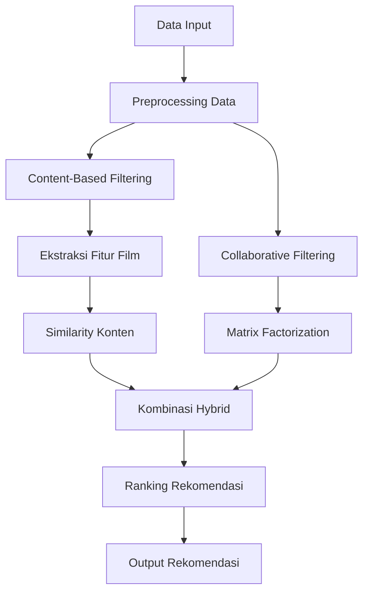

# Laporan Proyek Machine Learning -Ibrahim Akbar Arsanata

# Project Overview

Era digital ditandai dengan **information overload** yang membutuhkan cara penemuan kembali informasi yang efektif. Sistem rekomendasi muncul sebagai solusi untuk memberikan rekomendasi personal kepada pengguna sesuai preferensi mereka di tengah banjirnya informasi digital.[^1]  

Kemampuan untuk menyaring informasi dan menyajikan konten yang paling relevan bagi pengguna tidak hanya meningkatkan kepuasan pengguna tetapi juga menjadi faktor kunci dalam kesuksesan bisnis digital.
Berikut pengaruh **Kualitas dan Relevansi Konten**:  
  - Faktor kunci dalam membangun citra dan reputasi institusi.  
  - Meningkatkan pengalaman audiens, membangun kredibilitas, serta memperkuat komunikasi.  
  - Strategi penentuan relevansi yang meliputi Analisis audiens dan penelitian pasar dan Penyampaian pesan sesuai kebutuhan dan preferensi pengguna  
  - Konten penting yang kurang populer harus disajikan secara menarik untuk dampak positif.[^2]

Tak hanya itu **Pengalaman Pengguna** juga berperan sangat penting seperti: 
  - Berperan penting dalam membentuk citra positif layanan elektronik.  
  - Menciptakan loyalitas, meningkatkan kepuasan, dan kepercayaan pengguna. 
  - Pengalaman buruk dapat menyebabkan frustrasi dan migrasi pengguna ke platform lain.[^3]  

Tidak berbeda jauh, industri film juga menghadapi tantangan besar dalam menghadirkan konten yang sesuai dengan preferensi beragam pengguna. Perilaku konsumsi media menimbulkan tantangan utama dalam distribusi dan eksibisi, seperti:

1. **Distribusi Tidak Merata**:  
   - Bioskop dan layar terpusat di kota besar.  
   - Dominasi film asing (terutama Hollywood) di bioskop dan produksi.  

2. **Persaingan Ketat**:  
   - Maraknya platform digital (Netflix, Viu) yang agresif mendistribusikan film secara global.  
   - Film nasional sulit mendapatkan penonton meski mendapat slot layar besar.  

3. **Kebutuhan Adaptasi**:  
   - Penyeimbangan distribusi konvensional (bioskop) dan digital.  
   - Strategi distribusi adaptif dan dukungan kebijakan pemerintah (misalnya insentif pajak untuk film kurang diminati).
  
**Tantangan terbesar**: Bukan hanya ketersediaan layar, tetapi bagaimana menghadirkan konten relevan yang mudah diakses oleh audiens beragam, baik melalui bioskop maupun platform digital.[^4]  

Selain itu Cold start menjadi tantangan utama dalam industri film dengan dampak:  

- **Pengguna Baru**:  
  - Rekomendasi tidak personal, mengurangi retensi pengguna.  
- **Film Baru**:  
  - Minim eksposur, kurang kompetitif di pasar.  
- **Platform Streaming**:  
  - Risiko kehilangan pelanggan jika rekomendasi awal tidak menarik.[^5]
 
Untuk mengatasi hal tersebut dapat digunakan sistem hyrbid yang menggabungkan **Collaborative Filtering** (berbasis interaksi pengguna) dan **Content-Based Filtering** (berbasis metadata film seperti genre, sutradara, atau aktor).  Metode ini mampu memberikan rekomendasi awal untuk pengguna atau film baru dengan memanfaatkan kesamaan konten.[^6]  


# Busines Understanding

## Problem Statement
Tantangan utama yang diidentifikasi dalam industri film dan sistem rekomendasi:

1. **Overload Informasi dan Relevansi Konten**
   - Banjir informasi digital menyulitkan pengguna menemukan konten film yang relevan
   - Sistem konvensional sering gagal menampilkan konten berkualitas yang kurang populer

2. **Distribusi dan Aksesibilitas Film Tidak Merata**
   - Dominasi film asing dan distribusi bioskop tidak seimbang membatasi jangkauan film lokal/nasional
   - Minimnya layar bioskop di daerah non-urban memperparah masalah ini

3. **Masalah Cold Start**
   - Pengguna baru: Sistem tidak bisa memberikan rekomendasi personal karena kurangnya data interaksi
   - Film baru: Minim eksposur karena algoritma lebih memprioritaskan konten populer

4. **Persaingan dengan Platform Digital Global**
   - Platform streaming (Netflix, Viu) mendominasi dengan konten global, menyisihkan film lokal

5. **Pengalaman Pengguna (UX) yang Buruk**
   - Rekomendasi tidak akurat/tidak personal menurunkan kepuasan dan meningkatkan churn rate

## Goals
Target proyek untuk menjawab permasalahan di atas:

1. **Membangun Sistem Rekomendasi Hybrid**
   - Menggabungkan collaborative + content-based filtering untuk meningkatkan akurasi, khususnya bagi pengguna/film baru

2. **Meningkatkan Aksesibilitas Konten Lokal/Nasional**
   - Mengoptimalkan rekomendasi film lokal menggunakan metadata (genre, sutradara, bahasa)

3. **Mempersonalisasi Pengalaman Pengguna**
   - Menganalisis preferensi pengguna (riwayat tonton, rating) untuk mengurangi overload informasi

4. **Strategi Distribusi Digital-Konvensional**
   - Mengintegrasikan data bioskop dan streaming untuk rekomendasi multi-saluran

5. **Mengurangi Tingkat Churn Platform**
   - Meningkatkan retensi pengguna dengan rekomendasi onboarding yang lebih relevan

## Penyelarasan Masalah-Tujuan

| Pernyataan Masalah               | Tujuan                                 |
|----------------------------------|----------------------------------------|
| Overload informasi              | Sistem rekomendasi hybrid              |
| Distribusi tidak merata          | Fokus pada konten lokal/nasional       |
| Masalah cold start               | Gabungkan metadata + interaksi pengguna|
| Persaingan platform digital      | Rekomendasi multi-saluran              |
| UX buruk                         | Personalisasi berbasis preferensi      |

## Solution Statements

### 1. Hybrid Mixed (Kombinasi Beberapa Strategi)

Solusi hybrid dikembangkan untuk mengatasi tantangan spesifik dalam sistem rekomendasi film dengan memanfaatkan keunggulan dua pendekatan utama: Collaborative Filtering dan Content-Based Filtering. Pendekatan ini dirancang khusus untuk dataset yang mencakup:

- **Data pengguna**: rating, timestamp, usia, gender, pekerjaan
- **Data film**: judul, tahun rilis, 19 genre berbeda
- **Interaksi**: riwayat rating pengguna

### Alur Kerja Algoritma


**PENJELASAN**
1. **Data Preprocessing**
**Data Cleaning**
  - Penanganan missing values
  - Normalisasi skala rating (1-5)

2. **Feature Engineering**
| Feature Type       | Processing Method         | Details                     |
|--------------------|---------------------------|----------------------------|
| Multi-label genre  | Multi-hot encoding        | 19 kategori genre          |
| Occupation         | One-hot encoding          | -                          |
| Age/Gender         | Standard scaling          | -                          |

3. Model Architecture

- **Content-Based Filtering**
```python
{
  "Features": ["genre", "release_year", "title"],
  "Weights": [0.7, 0.2, 0.1],
  "Similarity": "Cosine similarity",
  "Vectorizer": "TF-IDF"
}
```

- **Collaborative Filtering**

```python
{
  "Algorithm": "ALS Matrix Factorization",
  "Latent Factors": 50,
  "Optimization": "Alternating Least Squares",
  "Hyperparameters": {
    "iterations": 15,
    "regularization": 0.1
  }
}
```

- ** Hybrid Combination**

final_score=0.6×CF_score+0.4×CB_score

⚡ Performance Advantages
Keunggulan	Penjelasan
Cold Start Handling	✔ New users: demographic-based
✔ New items: content similarity
Multidimensional Personalization	✔ Gabungan preferensi implisit & eksplisit
Feature Optimization	✔ Pemanfaatan 19 genre categories
✔ Pengolahan data demografi
⚠️ Limitations
diff
- Computational Complexity:
  * Butuh penyimpanan embedding matrix
  * Pelatihan dua model terpisah

- Weight Tuning:
  ! Rasio 60:40 perlu validasi empiris
  ! Sensitif terhadap distribusi data

- Metadata Dependency:
  # Kinerja turun jika metadata tidak lengkap


# Data Understanding

# Data Preparation

# Modeling

# Evaluation


Laporan Proyek Machine Learning - Nama Anda
Project Overview
Pada bagian ini, Kamu perlu menuliskan latar belakang yang relevan dengan proyek yang diangkat.

Rubrik/Kriteria Tambahan (Opsional):

Jelaskan mengapa dan bagaimana masalah tersebut harus diselesaikan
Menyertakan hasil riset terkait atau referensi. Referensi yang diberikan harus berasal dari sumber yang kredibel dan author yang jelas.
Format Referensi dapat mengacu pada penulisan sitasi IEEE, APA atau secara umum seperti di sini
Sumber yang bisa digunakan Scholar
Business Understanding
Pada bagian ini, Anda perlu menjelaskan proses klarifikasi masalah.

Bagian laporan ini mencakup:

Problem Statements
Menjelaskan pernyataan masalah:

Pernyataan Masalah 1
Pernyataan Masalah 2
Pernyataan Masalah n
Goals
Menjelaskan tujuan proyek yang menjawab pernyataan masalah:

Jawaban pernyataan masalah 1
Jawaban pernyataan masalah 2
Jawaban pernyataan masalah n
Semua poin di atas harus diuraikan dengan jelas. Anda bebas menuliskan berapa pernyataan masalah dan juga goals yang diinginkan.

Rubrik/Kriteria Tambahan (Opsional):

Menambahkan bagian “Solution Approach” yang menguraikan cara untuk meraih goals. Bagian ini dibuat dengan ketentuan sebagai berikut:

Solution statements
Mengajukan 2 atau lebih solution approach (algoritma atau pendekatan sistem rekomendasi).
Data Understanding
Paragraf awal bagian ini menjelaskan informasi mengenai jumlah data, kondisi data, dan informasi mengenai data yang digunakan. Sertakan juga sumber atau tautan untuk mengunduh dataset. Contoh: UCI Machine Learning Repository.

Selanjutnya, uraikanlah seluruh variabel atau fitur pada data. Sebagai contoh:

Variabel-variabel pada Restaurant UCI dataset adalah sebagai berikut:

accepts : merupakan jenis pembayaran yang diterima pada restoran tertentu.
cuisine : merupakan jenis masakan yang disajikan pada restoran.
dst
Rubrik/Kriteria Tambahan (Opsional):

Melakukan beberapa tahapan yang diperlukan untuk memahami data, contohnya teknik visualisasi data beserta insight atau exploratory data analysis.
Data Preparation
Pada bagian ini Anda menerapkan dan menyebutkan teknik data preparation yang dilakukan. Teknik yang digunakan pada notebook dan laporan harus berurutan.

Rubrik/Kriteria Tambahan (Opsional):

Menjelaskan proses data preparation yang dilakukan
Menjelaskan alasan mengapa diperlukan tahapan data preparation tersebut.
Modeling
Tahapan ini membahas mengenai model sisten rekomendasi yang Anda buat untuk menyelesaikan permasalahan. Sajikan top-N recommendation sebagai output.

Rubrik/Kriteria Tambahan (Opsional):

Menyajikan dua solusi rekomendasi dengan algoritma yang berbeda.
Menjelaskan kelebihan dan kekurangan dari solusi/pendekatan yang dipilih.
Evaluation
Pada bagian ini Anda perlu menyebutkan metrik evaluasi yang digunakan. Kemudian, jelaskan hasil proyek berdasarkan metrik evaluasi tersebut.

Ingatlah, metrik evaluasi yang digunakan harus sesuai dengan konteks data, problem statement, dan solusi yang diinginkan.

Rubrik/Kriteria Tambahan (Opsional):

Menjelaskan formula metrik dan bagaimana metrik tersebut bekerja.
---Ini adalah bagian akhir laporan---

Catatan:

Anda dapat menambahkan gambar, kode, atau tabel ke dalam laporan jika diperlukan. Temukan caranya pada contoh dokumen markdown di situs editor Dillinger, Github Guides: Mastering markdown, atau sumber lain di internet. Semangat!
Jika terdapat penjelasan yang harus menyertakan code snippet, tuliskan dengan sewajarnya. Tidak perlu menuliskan keseluruhan kode project, cukup bagian yang ingin dijelaskan saja.

Reference

[^1] MESIN REKOMENDASI FILM MENGGUNAKAN METODE KEMIRIPAN GENRE BERBASIS COLLABORATIVE FILTERING. (n.d.).
[^2] Zaman, S., Teknik, D., Uin, I., Malik, M., & Malang, I. (n.d.). Rencana Strategis Komunikasi Institusi: Membangun Kualitas dan Relevansi Konten untuk Masa Depan Ringkasan Eksekutif A. Pendahuluan.
[^3] 225027205_Bab 2. (n.d.).
[^4] Iswahyuningtyas, C. E., & Hidayat, M. F. (2021). Strategies and Challenges in Conventional and Digital Film Distribution and Exhibition in Indonesia. Jurnal Komunikasi, 13(1), 133. https://doi.org/10.24912/jk.v13i1.10033
[^5] 17650056. (n.d.).
[^6] Velamentosa, D., Zuliarso, E., & Raya Tri Lomba Juang, J. (2025). SISTEM REKOMENDASI FILM MENGGUNAKAN METODE CONTENT-BASED FILTERING. In Jurnal Mahasiswa Teknik Informatika) (Vol. 9, Issue 2).
