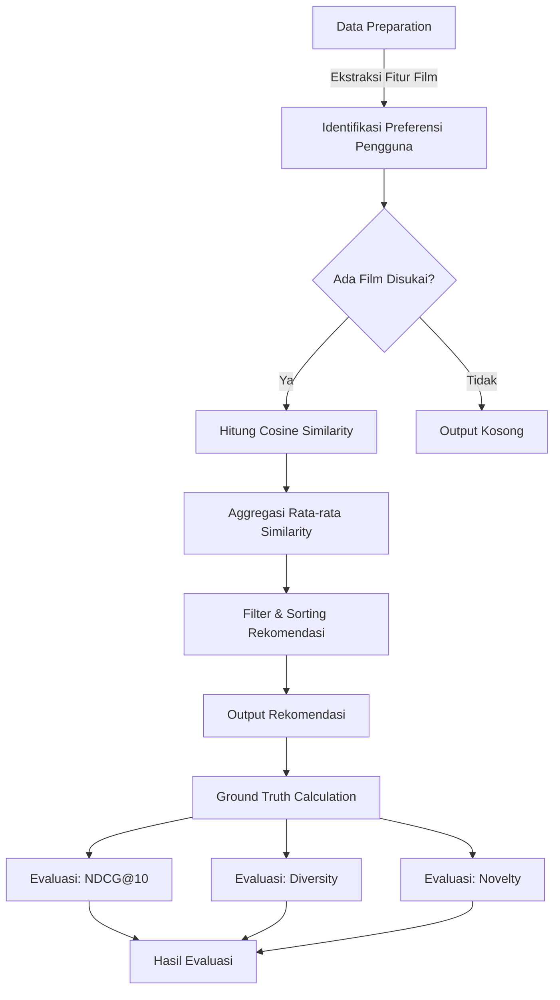
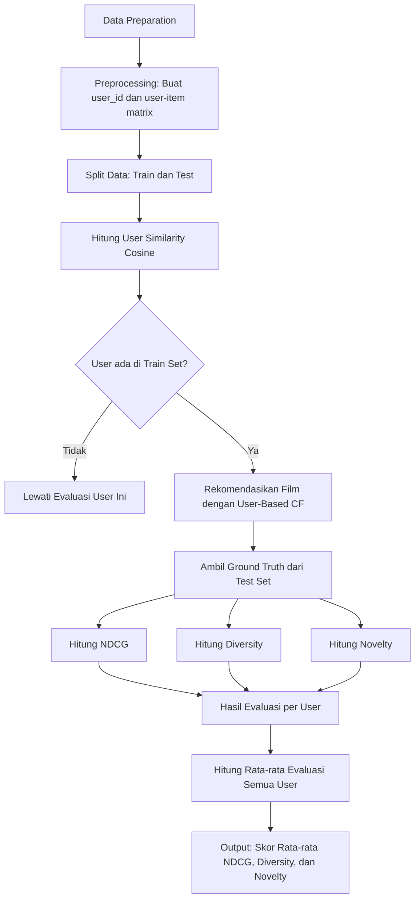

# Laporan Proyek Machine Learning -Ibrahim Akbar Arsanata

# Project Overview

Era digital ditandai dengan **information overload** yang membutuhkan cara penemuan kembali informasi yang efektif. Sistem rekomendasi muncul sebagai solusi untuk memberikan rekomendasi personal kepada pengguna sesuai preferensi mereka di tengah banjirnya informasi digital[^1].

Kemampuan untuk menyaring informasi dan menyajikan konten yang paling relevan bagi pengguna tidak hanya meningkatkan kepuasan pengguna tetapi juga menjadi faktor kunci dalam kesuksesan bisnis digital.
Berikut pengaruh **Kualitas dan Relevansi Konten**:  
  - Faktor kunci dalam membangun citra dan reputasi institusi.  
  - Meningkatkan pengalaman audiens, membangun kredibilitas, serta memperkuat komunikasi.  
  - Strategi penentuan relevansi yang meliputi Analisis audiens dan penelitian pasar dan Penyampaian pesan sesuai kebutuhan dan preferensi pengguna  
  - Konten penting yang kurang populer harus disajikan secara menarik untuk dampak positif[^2].

Tak hanya itu **Pengalaman Pengguna** juga berperan sangat penting seperti: 
  - Berperan penting dalam membentuk citra positif layanan elektronik.  
  - Menciptakan loyalitas, meningkatkan kepuasan, dan kepercayaan pengguna. 
  - Pengalaman buruk dapat menyebabkan frustrasi dan migrasi pengguna ke platform lain[^3].  

Tidak berbeda jauh, industri film juga menghadapi tantangan besar dalam menghadirkan konten yang sesuai dengan preferensi beragam pengguna. Perilaku konsumsi media menimbulkan tantangan utama dalam distribusi dan eksibisi, seperti:

1. **Distribusi Tidak Merata**:  
   - Bioskop dan layar terpusat di kota besar.  
   - Dominasi film asing (terutama Hollywood) di bioskop dan produksi.  

2. **Persaingan Ketat**:  
   - Maraknya platform digital (Netflix, Viu) yang agresif mendistribusikan film secara global.  
   - Film nasional sulit mendapatkan penonton meski mendapat slot layar besar.  

3. **Kebutuhan Adaptasi**:  
   - Penyeimbangan distribusi konvensional (bioskop) dan digital.  
   - Strategi distribusi adaptif dan dukungan kebijakan pemerintah (misalnya insentif pajak untuk film kurang diminati).
  
**Tantangan terbesar**: Bukan hanya ketersediaan layar, tetapi bagaimana menghadirkan konten relevan yang mudah diakses oleh audiens beragam, baik melalui bioskop maupun platform digital[^4].  

Selain itu Cold start menjadi tantangan utama dalam industri film dengan dampak:  

- **Pengguna Baru**:  
  - Rekomendasi tidak personal, mengurangi retensi pengguna.  
- **Film Baru**:  
  - Minim eksposur, kurang kompetitif di pasar.  
- **Platform Streaming**:  
  - Risiko kehilangan pelanggan jika rekomendasi awal tidak menarik[^5].
 
Untuk mengatasi hal tersebut dapat digunakan sistem hyrbid yang menggabungkan **Collaborative Filtering** (berbasis interaksi pengguna) dan **Content-Based Filtering** (berbasis metadata film seperti genre, sutradara, atau aktor).  Metode ini mampu memberikan rekomendasi awal untuk pengguna atau film baru dengan memanfaatkan kesamaan konten[^6].  


# Busines Understanding

## **Problem Statements**

### **Pernyataan Masalah 1: Cold Start Problem**  
Sistem rekomendasi tradisional tidak efektif dalam menangani pengguna baru dan film baru karena tidak ada riwayat interaksi atau rating sebelumnya.  
Contohnya: Pengguna baru tidak mendapatkan rekomendasi yang relevan, sehingga menurunkan kepuasan awal dan potensi retensi.

### **Pernyataan Masalah 2: Bias Popularitas**  
Sistem cenderung terlalu sering merekomendasikan film populer, mengabaikan film niche atau berkualitas yang kurang dikenal.  
Contohnya: Rekomendasi yang diberikan menjadi terlalu umum dan tidak personal.

### **Pernyataan Masalah 3: Ketergantungan pada Data Demografik**  
Penggunaan atribut demografik (seperti usia, gender, pekerjaan) dapat menyebabkan asumsi keliru dan rekomendasi stereotipikal.  
Contohnya: Sistem menyarankan film romance hanya karena pengguna adalah perempuan, tanpa mempertimbangkan preferensi aktual.

### **Pernyataan Masalah 4: Over-Specialization**  
Sistem berbasis konten sering kali hanya menyarankan film yang terlalu mirip dengan yang sudah disukai, menyebabkan kurangnya eksplorasi genre baru.  
Contohnya: Pengguna hanya direkomendasikan film horror karena sebelumnya menyukai genre tersebut.

---

## **Goals**

### **Goal 1: Meningkatkan Relevansi Rekomendasi untuk Pengguna/Film Baru**  
Memastikan pengguna baru atau film yang belum memiliki riwayat interaksi tetap menerima rekomendasi yang relevan, sehingga meningkatkan kepuasan dan retensi pengguna.  

### **Goal 2: Meningkatkan Diversitas Rekomendasi**  
Memastikan rekomendasi tidak didominasi film populer dengan menyertakan film niche/berkualitas, sehingga pengguna terpapar pilihan yang lebih beragam.  

### **Goal 3: Rekomendasi Berbasis Preferensi Aktual, Bukan Stereotip**  
Menghasilkan rekomendasi yang lebih personal dengan memprioritaskan perilaku pengguna (rating, penontonan) daripada atribut demografik.  

### **Goal 4: Mendorong Eksplorasi Konten Baru**  
Memastikan rekomendasi tidak hanya terfokus pada genre/film yang sudah dikenal pengguna, tetapi juga memperkenalkan opsi baru yang relevan.  


---

## **Solution Approach**

### **Solution 1: Content-Based Filtering (CBF)**  
Menggunakan informasi konten film (seperti genre dan tahun rilis) untuk menghitung kesamaan antar film dengan cosine similarity. Cocok untuk cold start karena tidak bergantung pada interaksi pengguna lain.

### **Solution 2: User-Based Filtering (UBF)**  
User-Based Filtering adalah salah satu teknik dalam sistem rekomendasi yang memberikan rekomendasi kepada pengguna berdasarkan kemiripan preferensi atau perilaku dengan pengguna lain.

### **Solution 3: Hybrid Approach (CBF + UBF)**  
Menggabungkan kedua metode di atas dengan bobot tertentu agar sistem tetap akurat dan fleksibel, terutama dalam mengatasi cold start dan menjaga personalisasi serta diversifikasi.


# Data Understanding

## Gambaran Umum
  Dataset MovieLens 100K merupakan kumpulan data rating film yang dikumpulkan oleh GroupLens Research Project dari University of Minnesota. Dataset ini berisi 100.000 rating (skala 1-5) dari 943 pengguna terhadap 1.682 film. Setiap pengguna memberikan setidaknya 20 rating, dan data dilengkapi dengan informasi demografis seperti usia, jenis kelamin, pekerjaan, dan kode pos. Data dikumpulkan melalui platform MovieLens antara September 1997 hingga April 1998 dan telah melalui proses pembersihan untuk memastikan kelengkapan data. Dataset ini umum digunakan untuk penelitian sistem rekomendasi, analisis preferensi pengguna, dan collaborative filtering.

- **Sumber**: GroupLens Research Project, University of Minnesota
- **Periode Pengumpulan**: 19 September 1997 - 22 April 1998
- **Total Rating**: 100.000 (skala 1-5)
- **Pengguna**: 943 (masing-masing memberi ≥20 rating)
- **Film**: 1.682
- **Data Demografis**: Usia, jenis kelamin, pekerjaan, kode pos
- **Lisensi**: Untuk penelitian non-komersial dengan atribusi wajib
- **Dimensi** : 100.000 baris dan 32 kolom
- **Tipe Data** : datetime64[ns](1), float64(1), int64(23), object(7)

**Tautan Unduhan**:
- [Kaggle](https://www.kaggle.com/datasets/prajitdatta/movielens-100k-dataset)
- [Situs Resmi GroupLens](https://grouplens.org/datasets/movielens/)

## Struktur File

### File Data Utama
1. **u.data** (Data rating utama)
   - Format: `user_id | item_id | rating | timestamp`
   - Pemisah: Tab
   - Timestamp: Detik Unix sejak 1/1/1970 UTC

2. **u.item** (Metadata film)
   - Berisi 24 kolom:
     ```
     movie_id | judul_film | tanggal_rilis | tanggal_rilis_video | 
     link_IMDb | 19_flag_genre (0/1)
     ```
   - Genre meliputi: Action, Adventure, Animation, dll.

3. **u.user** (Data demografi pengguna)
   - Format: `user_id | usia | jenis_kelamin | pekerjaan | kode_pos`

### File Pendukung
- **u.genre**: Daftar 19 genre film
- **u.occupation**: Daftar 21 jenis pekerjaan pengguna
- **u.info**: Ringkasan jumlah (pengguna, film, rating)

## Detail Variabel

### Data Rating
| Kolom | Tipe | Deskripsi |
|--------|------|-------------|
| user_id | integer | ID unik pengguna (1-943) |
| item_id | integer | ID unik film (1-1682) |
| rating | integer | Nilai rating (1-5) |
| timestamp | integer | Timestamp format Unix |

### Metadata Film
| Kolom | Tipe | Deskripsi |
|-------|------|-------------|
| movie_id | integer | ID unik film |
| title | string | Judul film + tahun rilis |
| release_date | string | Format DD-MMM-YYYY |
| video_release_date | string | Umumnya kosong |
| IMDb_URL | string | Tautan ke IMDb |
| [19 genre] | binary | 1 jika film termasuk genre tersebut |

### Data Demografi Pengguna
| Kolom | Tipe | Deskripsi |
|-------|------|-------------|
| user_id | integer | ID unik pengguna |
| age | integer | Usia pengguna |
| gender | string | 'M' atau 'F' |
| occupation | string | 21 kategori pekerjaan |
| zip_code | string | Kode pos AS |

### Keterangan genre
| Genre | Indeks |
|-------|--------|
| unknown | 0 |
| Action | 1 |
| Adventure | 2 |
| Animation | 3 |
| Children's | 4 |
| Comedy | 5 |
| Crime | 6 |
| Documentary | 7 |
| Drama | 8 |
| Fantasy | 9 |
| Film-Noir | 10 |
| Horror | 11 |
| Musical | 12 |
| Mystery | 13 |
| Romance | 14 |
| Sci-Fi | 15 |
| Thriller | 16 |
| War | 17 |
| Western | 18 |


## Exploratory Data Analysis

## Rata - rata per bulan


  Pada kolom rating, penurunan nilai rata-rata dari waktu ke waktu dapat mengindikasikan adanya penurunan kepuasan pengguna terhadap konten film yang ditawarkan. Hal ini mungkin disebabkan oleh perubahan kualitas film, ekspektasi pengguna yang semakin tinggi, atau faktor eksternal seperti banyaknya kompetitor di pasar streaming. Sementara itu, fluktuasi pada kolom age menunjukkan variasi usia rata-rata pengguna dari bulan ke bulan, yang bisa mencerminkan perubahan demografi penonton. Misalnya, peningkatan usia rata-rata mungkin terjadi ketika platform lebih banyak menayangkan film-film klasik yang menarik minat penonton dewasa, sedangkan penurunan usia rata-rata dapat terkait dengan rilis film-film animasi atau genre young adult yang populer di kalangan penonton muda.

  Untuk kolom video_release_date, pola yang terlihat mungkin berkaitan dengan musim rilis film. Beberapa bulan tertentu, seperti akhir tahun (November-Desember), sering kali menjadi periode rilis film-film besar, sehingga memengaruhi rata-rata tanggal rilis video. Sebaliknya, bulan-bulan dengan aktivitas rilis yang lebih rendah, seperti awal tahun, dapat menunjukkan penurunan dalam nilai rata-rata. Interpretasi ini memperkuat pentingnya analisis lebih lanjut untuk memastikan apakah pola tersebut bersifat musiman atau dipengaruhi oleh faktor lain seperti strategi distribusi konten oleh platform.

## Rata rata genre per bulan


### Genre dengan Fluktuasi Tertinggi
1. **Horror (genre_11)**: 
   - Mencapai puncak di Oktober (+15-20% dari rata-rata) 
   - Konsisten dengan tradisi Halloween
   - *Rekomendasi*: Program marathon film horor di bulan Oktober

2. **Romance (genre_14)**:
   - Lonjakan 12-15% di Februari (Valentine)
   - Penurunan signifikan di April
   - *Peluang*: Bundle romance-comedy untuk "Palentine's Day"

3. **Children's (genre_4)**:
   - Puncak di Desember (+18%) 
   - Tren turun drastis di Januari-Februari
   - *Insight*: Orang tua lebih aktif menonton film anak selama liburan sekolah

### 📊 Genre Paling Stabil
1. **Drama (genre_8)**:
   - Persentase konstan 22-25% tiap bulan
   - *Implikasi*: Genre "penopang" platform sepanjang tahun

2. **Documentary (genre_7)**:
   - Fluktuasi <3% 
   - *Pola*: Penonton setia tanpa musiman jelas

## Analisis Kompetitif Genre

### Genre yang Saling Menggantikan
| Bulan | Genre Naik | Genre Turun | Rasio |
|-------|------------|-------------|-------|
| Nov-Dec | Fantasy (+7%) | Crime (-5%) | 1.4:1 |
| Feb-Mar | Sci-Fi (+9%) | Western (-6%) | 1.5:1 |

*Interpretasi*: Penonton cenderung beralih dari genre realistik ke spekulatif di musim dingin


## Distribusi 

#### Numerikal


Distribusi user_id dan movie_id menunjukkan pola yang mirip dengan Prinsip Pareto, di mana sebagian kecil pengguna (dengan user_id rendah) dan film (dengan movie_id rendah) mendominasi aktivitas platform. Hal ini mengindikasikan bahwa platform mungkin bergantung pada power users dan konten populer lama, sementara pengguna baru atau konten baru kurang mendapat perhatian. Insight ini menyarankan perlunya strategi untuk meningkatkan engagement pengguna baru, seperti personalisasi rekomendasi atau program loyalitas.

Distribusi rating menunjukkan bahwa pengguna cenderung memberikan nilai 3.0–4.0, dengan sangat sedikit rating ekstrem (1.0 atau 5.0). Ini bisa mencerminkan bias psikologis (enggan memberi nilai terlalu jelek/sempurna) atau kurangnya fitur umpan balik yang mendorong penilaian lebih beragam. Platform bisa mempertimbangkan skala rating yang lebih dinamis (misalnya, dengan ulasan berbasis emoji) atau memberikan insentif untuk memberikan rating lebih jujur.

#### Kategorikal


Dapat dilihat pada visualisasi diatas bahwa dominasi penonton laki-laki dalam dataset ini bisa mencerminkan bias platform atau preferensi genre. Film-film sci-fi seperti Star Wars dan Return of the Jedi yang mendominasi mungkin lebih menarik bagi audiens pria, atau bisa juga menunjukkan bahwa platform ini populer di kalangan tertentu, seperti pelajar (22%) dan profesional di bidang teknologi (engineer, programmer). Fakta bahwa Fargo—film dengan nuansa kritikus—masuk dalam 5 besar bersama komedi seperti Liar Liar menunjukkan keberagaman selera, meski tetap didominasi oleh film-film kultus.

Yang menarik, banyak film tercatat rilis pada 1 Januari (1995, 1994, dll.), yang kemungkinan besar adalah placeholder karena ketidaklengkapan data. Hal ini perlu diperbaiki agar analisis temporal seperti tren rilis film tidak bias. Selain itu, tingginya partisipasi pelajar dan pendidik bisa menjadi petunjuk bahwa film digunakan untuk hiburan sekaligus edukasi—misalnya, film Contact yang bertema sains mungkin dipilih untuk tujuan pembelajaran.


Laki-laki mendominasi hampir semua kategori pekerjaan, terutama di bidang teknis seperti engineer dan programmer, serta di kalangan student. Hal ini mencerminkan ketidakseimbangan gender dalam partisipasi platform/data atau bias industri (misalnya, lebih banyak pria di STEM).

Perempuan (F) memiliki representasi yang lebih rendah, kecuali di pekerjaan seperti librarian dan educator, di mana perbedaannya tidak terlalu mencolok.


Distribusi genre film dalam dataset ini mengungkapkan pola menarik yang selaras dengan temuan sebelumnya mengenai dominasi laki-laki di kalangan pengguna platform. Drama (genre_8) dan komedi (genre_5) muncul sebagai genre paling populer, mencerminkan preferensi umum masyarakat akan hiburan yang mudah dinikmati dan bersifat universal. Namun, genre seperti sci-fi (genre_15) dan action (genre_1) yang cenderung lebih digemari oleh audiens laki-laki—sejalan dengan dominasi mereka di bidang STEM—juga menempati posisi menonjol.

Fakta bahwa genre "feminin" seperti romance (genre_14) atau musical (genre_12) tidak mendominasi bisa jadi merupakan cerminan dari bias platform yang didominasi oleh pengguna pria, atau bahkan bias industri film itu sendiri. Sementara itu, genre niche seperti film-noir (genre_10) dan western (genre_18) yang minim jumlahnya menunjukkan pergeseran selera pasar atau tantangan produksi.

Keterkaitan antara data pekerjaan dan genre film semakin memperkuat narasi ini. Dominasi pelajar (student) sebagai kelompok terbesar pengguna platform mungkin menjelaskan popularitas genre komedi dan drama, yang sering menjadi pilihan hiburan utama bagi kalangan muda. Namun, minimnya film dokumenter (genre_7) mengindikasikan potensi kurangnya konten edukatif, meskipun platform banyak diakses oleh pelajar dan pendidik.

Kesimpulan: Dataset ini tidak hanya menggambarkan preferensi genre, tetapi juga merefleksikan dinamika gender dan demografik pengguna. Ketidakseimbangan yang terlihat bisa berasal dari bias budaya, bias platform, atau bahkan metode pengumpulan data. Untuk menciptakan ekosistem yang lebih inklusif, perlu ada upaya untuk mempromosikan keberagaman genre dan memastikan representasi yang seimbang bagi semua kelompok pengguna. Analisis lebih lanjut dengan mempertimbangkan variabel seperti usia, lokasi, dan preferensi pribadi akan membantu mengungkap wawasan yang lebih mendalam.

## Missing Value


Dapat dilihat diatas bahwa terlihat banyak sekali missing value pada video_release_date dengan persenatse 100%, untuk kolom numerik yang lain dapat dilihat bahwa tidak ada indikasi adanya missing value. Untuk kolom kategorik biasanya missing value tidak berisi nan sehingga tidak teridentifikasi. Mari kita identifikasi lebih lanjut.

---

## Movie_title

Sebelumnya dilaporkan 0 missing, tetapi setelah dilakukan analisis mendalam ternyata ada 79 entri dengan nilai unknown yang tidak terdeteksi sebagai NaN.

## Occupation

Sebelumnya dilaporkan 0 missing, tetapi setelah dilakukan analisis mendalam ternyata ada 2241 entri dengan nilai none yang tidak terdeteksi sebagai NaN.

Ini terasa sedikit ganjal karna banyak sekali missing valuenya, mari kita gali lebih mendalam lagi apakah ini benar missing value? atau ada maksud lain? kita gunakan teknik summary statistic dan distribusi untuk menggalinya

**Hasil analisis**

**Tabel Distribusi Pekerjaan (Occupation)**

| **Pekerjaan (Occupation)**  | **Jumlah** |
|-----------------------------|-----------:|
| student                     |     21,956 |
| other                       |     10,662 |
| educator                    |      9,441 |
| engineer                    |      8,174 |
| programmer                  |      7,800 |
| administrator               |      7,479 |
| writer                      |      5,535 |
| librarian                   |      5,273 |
| technician                  |      3,505 |
| executive                   |      3,403 |
| healthcare                  |      2,804 |
| artist                      |      2,308 |
| entertainment               |      2,094 |
| scientist                   |      2,058 |
| marketing                   |      1,950 |
| retired                     |      1,609 |
| lawyer                      |      1,345 |
| none                        |        900 |
| salesman                    |        856 |
| doctor                      |        540 |
| homemaker                   |        299 |

**Tabel Statistik Usia (Age)**

| **Statistik** | **Nilai** |
|---------------|----------:|
| count         |    900.00 |
| mean          |     25.01 |
| std           |      8.79 |
| min           |     11.00 |
| 25%           |     20.00 |
| 50% (median)  |     20.00 |
| 75%           |     35.00 |
| max           |     55.00 |


Kolom "none" dalam distribusi ini kemungkinan besar bukan menunjukkan *missing value*, melainkan individu yang secara eksplisit menyatakan tidak memiliki pekerjaan (misalnya mengisi "none" atau "tidak bekerja" dalam survei). Berikut argumen singkatnya:

1. **Konteks Kategorikal**:  
   "none" muncul sebagai kategori tersendiri dalam daftar occupation (seperti "student", "retired", dll.), yang mengindikasikan bahwa ini adalah nilai valid yang dipilih responden.

2. **Statistik Terukur**:  
   Kolom ini memiliki statistik deskriptif (count=900, mean usia=25, dll.), yang tidak mungkin ada jika data benar-benar *missing* (biasanya ditandai dengan NaN atau count=0).

3. **Profil Demografis**:  
   Usia rata-rata kelompok "none" (25 tahun) dan distribusi usia (min=11, max=55) konsisten dengan kelompok tidak bekerja, seperti pelajar muda, pengangguran, atau orang yang memilih tidak berkarir.

4. **Konsistensi dengan Kategori Lain**:  
   Kategori seperti "retired" atau "homemaker" juga menggambarkan status non-pekerjaan, sehingga "none" mungkin adalah bagian dari pola yang sama.

**Kesimpulan**: "none" adalah kategori occupation yang sah, merepresentasikan responden yang tidak memiliki pekerjaan formal, bukan data yang hilang.

## Age

Tidak memiliki missing value karna hanya memiliki 2 kolom unik yaitu M dan F

---

# Data Preparation 

## Konversi Tipe Data
Setelah dilakukan pengecekan tipe data ternyata ada kolom yang tidak cocok yaitu Kolom release_date, kolom ini awalnya berisi tanggal dalam format string. Maka dari itu dengan fungsi pd.to_datetime() akan otomatis melakukan:
- Mengidentifikasi format tanggal secara otomatis (misalnya: YYYY-MM-DD, DD/MM/YYYY).

- Mengubah string/objek menjadi tipe datetime64[ns], yang memungkinkan operasi berbasis waktu seperti ekstraksi tahun, bulan, atau perhitungan selisih tanggal.

- Jika format tanggal tidak jelas (misalnya "10-11-12"), pandas akan mencoba menebaknya atau memberikan error jika tidak valid.

Kemudian Hasil konversi disimpan kembali ke kolom release_date, menggantikan nilai aslinya.

## Missing Value

### Kolom `movies_title`
Setelah dilakukan inspeksi lebih lanjut, ternyata Missing valuenya hanya sedikit sehingga teknik yang dilakukan pada penanganan missing value pada kolom movie title adalah dengan cara **menghapus semua baris yang mengandung missing value 'move_title == unknown'**

### Kolom `occupation` (Pekerjaan)
Dikarenakan setelah dilakukan analisis lebih mendalam ternyata kolom none bukan merupakan missing value melainkan orang yang tidak memiliki pekerjaan maka **teknik yang digunakan dalam kasus kolom occupation adalah mengganti nilai `none` menjadi `unemployment` untuk memperjelas bahwa ini adalah kategori pekerjaan.**

### Kolom `video_release_date`
Kolom ini memiliki *missing value* mendekati 100% sehingga dianggap tidak informatif. Karena sudah ada kolom `release_date`, maka **teknik yang digunakan dalam kasus video_release_date adalah menghapus kolom video_release_date dengan kata lain kita tidak gunakan kolom ini**

## Encode

Encode dalam sistem rekomendasi wajib dilakukan karena data yang digunakan sering kali berupa kategori atau teks yang tidak dapat langsung diproses oleh algoritma machine learning. Sebagian besar model rekomendasi, seperti collaborative filtering atau content-based filtering, membutuhkan input berupa numerik untuk menghitung similarity atau melakukan prediksi. Encode, seperti one-hot encoding atau label encoding, mengubah data kategorikal (misalnya genre film atau ID pengguna) menjadi format numerik yang dapat dimengerti oleh model. Tanpa proses ini, sistem tidak akan mampu memproses data secara efektif, sehingga menghasilkan rekomendasi yang tidak akurat atau bahkan gagal berfungsi.

Selain itu, encode juga membantu dalam menangani heterogenitas data dan meningkatkan efisiensi komputasi. Dalam sistem rekomendasi, data sering berasal dari berbagai sumber dengan format berbeda, seperti teks, angka, atau kategori. Encode menyederhanakan data tersebut menjadi representasi seragam yang memudahkan algoritma untuk mempelajari pola dan hubungan antarfitur. Teknik seperti embedding (misalnya word2vec atau matrix factorization) bahkan dapat menangkap makna semantik atau relasi kompleks dalam data, seperti preferensi pengguna atau kemiripan item. Dengan demikian, encode tidak hanya memungkinkan sistem rekomendasi untuk bekerja, tetapi juga meningkatkan kualitas dan relevansi output yang dihasilkan.

### **Keterangan Mapping Encode**

### Gender Encoding Mapping

| Gender | Encoded Value |
| ------ | ------------- |
| F      | 0             |
| M      | 1             |

### Occupation Encoding Mapping

| Occupation    | Encoded Value |
| ------------- | ------------- |
| administrator | 0             |
| artist        | 1             |
| doctor        | 2             |
| educator      | 3             |
| engineer      | 4             |
| entertainment | 5             |
| executive     | 6             |
| healthcare    | 7             |
| homemaker     | 8             |
| lawyer        | 9             |
| librarian     | 10            |
| marketing     | 11            |
| other         | 12            |
| programmer    | 13            |
| retired       | 14            |
| salesman      | 15            |
| scientist     | 16            |
| student       | 17            |
| technician    | 18            |
| unemployment  | 19            |
| writer        | 20            |


### Teknik dan kelebihan teknik ini

Untuk encode ini sebenarnya ada banyak teknik yang bisa diterapkan. Tetapi untuk kasus ini akan digunakan teknik label encoder karena beberapa alasan berikut:

1. **Efisiensi Komputasi**  
   Label Encoding mengonversi nilai kategorikal (*Male/Female*, *student/engineer*) menjadi angka integer (contoh: `gender: M=0, F=1` atau `occupation: student=0, educator=1`). Ini mengurangi penggunaan memori dibanding One-Hot Encoding, terutama untuk kolom dengan banyak kategori seperti *occupation* (misal: 21 jenis pekerjaan). Sistem rekomendasi sering memproses data besar, sehingga efisiensi sangat krusial.

2. **Kompatibilitas dengan Algoritma**  
   Banyak algoritma recommendation system (seperti **Matrix Factorization** atau **KNN**) memerlukan input numerik. Label Encoding memenuhi syarat ini tanpa menambah dimensi data secara eksponensial seperti One-Hot Encoding yang bisa menghasilkan *sparse matrix*.


**Kesimpulan**
Label Encoding dipilih karena **sederhana, cepat, dan cukup efektif** untuk fitur seperti *gender* dan *occupation* dalam sistem rekomendasi dasar.


---

## Feature Selection

Pemilihan fitur berikut digunakan untuk membangun sistem rekomendasi dengan pendekatan:
- **Collaborative Filtering**
- **Content-Based Filtering**
- **Hybrid Recommendation**

| Fitur | Alasan Pemilihan |
|------|-------------------|
| `rating` | Mewakili preferensi pengguna secara langsung |
| `age`, `gender`, `occupation` | Informasi demografis yang memengaruhi selera pengguna |
| `movie_title`, `release_date` | Identifikasi unik film dan analisis temporal |
| `genre_0` s/d `genre_18` | Genre penting untuk filtering berbasis konten (dalam format one-hot encoding) |

Kombinasi dari semua fitur ini memungkinkan sistem rekomendasi yang **lebih akurat dan personal**, baik berdasarkan perilaku pengguna maupun konten film itu sendiri.

### **Kelebihan Pilihan Fitur Ini**
1. **Coverage Komprehensif**:
   - Memuat informasi pengguna (demografi) dan film (metadata)
   - Genre sebagai fitur penting untuk content-based filtering

2. **Kesesuaian untuk Hybrid Recommendation**:
   - Kombinasi fitur mendukung pendekatan hybrid (collaborative + content-based)


---

## Ekstrak Tahun Rilis (`release_year`)

Ekstraksi tahun dari tanggal rilis film menjadi format tahun tunggal (seperti mengubah **"1997-01-24"** menjadi **1997**) sangat penting dalam pembuatan sistem rekomendasi film karena beberapa alasan mendasar. Pertama, hal ini menyederhanakan data dengan mengurangi dimensi yang tidak perlu—informasi hari dan bulan pada tanggal rilis jarang berdampak signifikan pada preferensi pengguna, sementara tahun rilis mampu mewakili konteks era produksi film yang relevan. Kedua, format numerik tahun lebih mudah diolah oleh model machine learning, baik untuk analisis statistik maupun pembobotan, sehingga meningkatkan efisiensi komputasi. Ketiga, tahun rilis mencerminkan karakteristik zeitgeist (semangat zaman) tertentu; misalnya, film tahun 1990-an cenderung memiliki gaya visual, tema, atau teknik produksi yang khas, yang dapat memengaruhi kesukaan penonton. Keempat, fitur ini memungkinkan sistem mengenali pola temporal, seperti selisih antara tahun rating diberikan dan tahun rilis film—sebuah variabel yang sering berkorelasi dengan bias nostalgia atau penilaian terhadap film "klasik". Terakhir, penyederhanaan ini membantu mengatasi masalah sparse data, khususnya untuk film-film dengan tanggal rilis yang unik tetapi tahun yang sama, sehingga memperkuat generalisasi model. Dengan demikian, ekstraksi tahun bukan hanya langkah praktis, tetapi juga strategis untuk menangkap pola preferensi yang lebih dalam.


## Ekstrak Judul Film (`movie_title`)

Pembersihan dan standardisasi data pada kolom **movie_title** dengan menghapus keterangan tahun, koma, kata "The", serta spasi di awal dan akhir merupakan langkah krusial untuk memastikan konsistensi dalam sistem rekomendasi. Pertama, penghapusan tahun rilis (misal: **"Toy Story (1995)"** menjadi **"Toy Story"**) menghilangkan redundansi karena informasi tahun sudah tersedia di kolom terpisah (**release_year**), sekaligus mencegah duplikasi saat menghitung kemiripan judul. Kedua, penghapusan koma dan kata "The" di awal judul (contoh: **"The Godfather"** menjadi **"Godfather"**) menyeragamkan format untuk memudahkan pencocokan string—tanpa langkah ini, sistem mungkin memperlakukan **"The Godfather"** dan **"Godfather"** sebagai dua film berbeda. Ketiga, pembersihan spasi di awal/akhir judul (**"  Pulp Fiction  "** menjadi **"Pulp Fiction"**) mencegah kesalahan teknis dalam pemrosesan teks, terutama saat menggunakan metode berbasis tokenisasi atau embedding. Proses ini juga memungkinkan *fuzzy matching* yang lebih akurat ketika judul memiliki variasi penulisan kecil. Hasilnya adalah representasi judul yang lebih bersih dan terstandarisasi, yang meningkatkan reliabilitas dalam: (1) penghitungan similarity berbasis teks, (2) pengelompokan film, maupun (3) integrasi dengan data eksternal (seperti API IMDB) yang mungkin menggunakan format berbeda. Dengan demikian, transformasi ini bukan sekadar pembersihan kosmetik, melainkan fondasi untuk analisis konten yang lebih robust.

---

> Dengan langkah-langkah persiapan data ini, sistem rekomendasi film menjadi lebih robust, bersih, dan siap digunakan dalam pengembangan model yang akurat dan relevan untuk pengguna.


# Modeling

## 1. Sistem Rekomendasi Berbasis Konten (Content-Based Filtering)

Sistem Rekomendasi Berbasis Konten (Content-Based Filtering) adalah salah satu pendekatan dalam sistem rekomendasi yang merekomendasikan item kepada pengguna berdasarkan kesamaan antara konten/item yang disukai di masa lalu dengan item baru yang mungkin diminati. Sistem ini bekerja dengan menganalisis fitur atau atribut dari item yang telah berinteraksi dengan pengguna (misalnya, produk, film, musik, artikel) dan mencari item lain dengan karakteristik serupa.

### Cara Kerja



---

### **Alur Utama Content-Based Filtering (CBF)**  
1. **Persiapan Data**  
   - Sistem mengumpulkan fitur film (genre, tahun rilis) dan mengubahnya menjadi representasi numerik.  
   - Data duplikat dihapus untuk efisiensi.  

2. **Identifikasi Preferensi Pengguna**  
   - Sistem mencari riwayat rating pengguna berdasarkan profil (contoh: gender = *Female*, occupation = *Student*).  
   - Film dengan rating tertinggi diambil sebagai acuan preferensi (*liked movies*).  

3. **Penanganan Kasus Khusus**  
   - Jika pengguna tidak memiliki riwayat (*cold start*), sistem tidak bisa memberikan rekomendasi.  

4. **Perhitungan Kemiripan**  
   - Sistem menghitung kesamaan konten antara film yang disukai dan semua film lain menggunakan *cosine similarity*.  

5. **Peringkat Rekomendasi**  
   - Hasil similarity dirata-rata untuk setiap film.  
   - Film yang sudah dikonsumsi pengguna difilter, lalu diurutkan berdasarkan skor tertinggi.  

6. **Output Rekomendasi**  
   - Daftar film yang belum dikonsumsi, diurutkan dari yang paling relevan.  

---

### **Alur Evaluasi Rekomendasi**  
1. **Pembentukan Ground Truth**  
   - Sistem menentukan standar rekomendasi ideal dengan mengambil film yang diberi rating tinggi oleh pengguna (≥ persentil ke-80).  

2. **Pengukuran Akurasi (NDCG@10)**  
   - Membandingkan rekomendasi sistem dengan *ground truth*.  
   - Memperhitungkan posisi ranking (rekomendasi di urutan atas diberi bobot lebih).  
   - Nilai 1 berarti rekomendasi sempurna, 0 berarti tidak akurat sama sekali.  

3. **Pengukuran Keragaman (Diversity)**  
   - Menghitung seberapa berbeda film-film yang direkomendasikan.  
   - Semakin rendah kesamaan konten antar film, semakin tinggi skor diversity (mendekati 1).  

4. **Pengukuran Kebaruan (Novelty)**  
   - Mengevaluasi seberapa jarang/populer film yang direkomendasikan.  
   - Film yang kurang populer di dataset mendapat skor novelty lebih tinggi.  

5. **Hasil Evaluasi**  
   - Tiga metrik dilaporkan:  
     - **NDCG@10**: Akurasi rekomendasi.  
     - **Diversity**: Keragaman konten.  
     - **Novelty**: Tingkat ketidakpopuleran.  

---


### Top N Recomendation
**Informasi Pengguna**
- **Jenis Kelamin**: Laki-laki (M)
- **Pekerjaan**: Bidang hiburan (*entertainment*)
- **Film yang Disukai (dari pengguna serupa)**:  
  - *Gattaca*  
  - *Big Sleep*

---

**Rekomendasi Teratas**

| No. | Judul Film                   | Skor Kemiripan |
|-----|------------------------------|----------------|
| 1   | Chinatown                    | 1.0000         |
| 2   | 2001: A Space Odyssey        | 1.0000         |
| 3   | Day the Earth Stood Still    | 1.0000         |
| 4   | Palmetto                     | 1.0000         |
| 5   | Ice Storm                   | 1.0000         |
| 6   | Trainspotting                | 1.0000         |
| 7   | Powder                       | 1.0000         |
| 8   | Ladybird Ladybird            | 1.0000         |
| 9   | Angela                       | 1.0000         |
| 10  | Desert Winds                 | 1.0000         |

---

**Interpretasi**

Berdasarkan data pengguna serupa dengan karakteristik gender *laki-laki* dan pekerjaan di bidang *entertainment*, serta preferensi film seperti *Gattaca* dan *Big Sleep*, sistem menghasilkan rekomendasi dengan skor kemiripan tertinggi (1.0000) terhadap beberapa film.

- **Kesamaan Genre dan Tema**: Film seperti *Chinatown* dan *Big Sleep* berbagi unsur genre seperti misteri dan film-noir, sementara *Gattaca* berbagi unsur sci-fi dan narasi futuristik dengan film seperti *2001: A Space Odyssey*.
- **Relevansi Profil Pengguna**: Pekerjaan di bidang hiburan menunjukkan kecenderungan terhadap film dengan kompleksitas naratif dan nilai artistik tinggi, yang sesuai dengan film-film dalam daftar seperti *Trainspotting* atau *Ladybird Ladybird*.
- **Skor Kemiripan Maksimum**: Skor 1.0000 menunjukkan bahwa film yang direkomendasikan memiliki profil fitur (genre, tema, atau preferensi pengguna serupa) yang sangat cocok dengan film yang disukai oleh pengguna.

Rekomendasi ini sangat cocok untuk pengguna dengan ketertarikan pada film-film dengan kedalaman tema, drama intens, dan eksplorasi psikologis atau sosial.


### Kelebihan
- Tidak Membutuhkan Data Rating yang Banyak:
  - Cukup bekerja dengan beberapa film favorit pengguna
  - Cocok untuk cold-start problem ketika belum banyak data rating

- Transparan dan Dapat Dijelaskan:
  - Rekomendasi berdasarkan kesamaan fitur yang jelas (genre, tahun rilis)
  - Mudah menjelaskan mengapa suatu item direkomendasikan

- Personalized:
  - Rekomendasi spesifik berdasarkan preferensi individu
  - Tidak terpengaruh oleh popularitas item

- Efisien secara Komputasi:
  - Penggunaan float32 mengurangi beban memori
  - Perhitungan similarity hanya dilakukan untuk film yang disukai

### Kekurangan:
- Terbatas pada Fitur yang Ada:
  - Hanya mempertimbangkan genre dan tahun rilis
  - Tidak menangkap aspek lain seperti aktor, sutradara, atau tema

- Over-Specialization:
  - Cenderung merekomendasikan item yang sangat mirip
  - Kurang mampu memberikan rekomendasi yang beragam atau mengejutkan

- Ketergantungan pada Data Demografik:
  - Mengasumsikan pengguna dengan gender dan occupation yang sama memiliki preferensi serupa
  - Tidak menangkap preferensi individual yang unik

- Scalability:
  - Perhitungan similarity bisa menjadi mahal secara komputasi ketika katalog film sangat besar
  - Membutuhkan pembaruan model ketika fitur film berubah
 
## 2. User-Based Filtering

Collaborative Filtering atau lebih spesifiknya User-Based Filtering (UBF) adalah salah satu teknik recommender system yang merekomendasikan item berdasarkan preferensi pengguna lain yang memiliki kesamaan (neighbors). Namun, data interaksi pengguna-item biasanya sangat sparse (matriks besar dengan banyak nilai kosong), sehingga diperlukan optimasi untuk meningkatkan efisiensi dan akurasi. Sistem ini mencari pengguna (users) yang memiliki pola preferensi serupa dengan target user dan rekomendasi dibuat berdasarkan item yang disukai oleh neighbor users (pengguna mirip) tetapi belum dilihat/dibeli oleh target user.

### Cara kerja




---

### **Penjelasan Setiap Langkah**

1. **Data Preparation**

* Menyalin data yang telah dipilih (`df_selected`), menghindari manipulasi data asli.

2. **Preprocessing**

* Membuat `user_id` gabungan dari umur, gender, dan pekerjaan.
* Menyusun **user-item matrix** di mana baris = pengguna, kolom = film, isi = rating.

3. **Split Data**

* Data dibagi menjadi **train (80%)** dan **test (20%)** untuk evaluasi.

4. **Hitung User Similarity**

* Menggunakan **cosine similarity** untuk menghitung kemiripan antar pengguna berdasarkan train data.

5. **Cek Ketersediaan User di Train Set**

* Jika pengguna tidak ditemukan dalam data train, dia **dilewati** dalam proses evaluasi.

6. **Lewati Evaluasi**

* User tidak dievaluasi karena tidak memiliki riwayat dalam train set (cold start problem).

7. **Rekomendasikan Film**

* Sistem mencari pengguna yang paling mirip dan memberikan film berdasarkan rating tertimbang dari mereka.

8. **Ambil Ground Truth**

* **Ground truth** adalah daftar film yang diberi rating oleh user di **test set**.
* Digunakan sebagai acuan evaluasi.

9. **Hitung NDCG (Normalized Discounted Cumulative Gain)**

* Mengukur akurasi peringkat rekomendasi dengan membandingkan posisi film dalam hasil prediksi terhadap ground truth.

10. **Hitung Diversity**

* Mengukur seberapa **berbeda genre** antar film yang direkomendasikan.
* Menggunakan cosine similarity antara vektor genre.

11. **Hitung Novelty**

* Mengukur seberapa **tidak populer** film rekomendasi (semakin tidak populer → semakin tinggi novelty-nya).

12. **Hasil Evaluasi per User**

* Menyimpan nilai evaluasi untuk setiap user: NDCG, Diversity, dan Novelty.

13. **Hitung Rata-rata**

* Mengambil rata-rata dari semua skor evaluasi pengguna.

14. **Output**

* Menampilkan skor akhir:

  * **NDCG**: Seberapa akurat rekomendasinya.
  * **Diversity**: Seberapa bervariasi film yang direkomendasikan.
  * **Novelty**: Seberapa baru/unik film yang direkomendasikan.

---

Kalau kamu ingin visualisasi ini sebagai gambar atau ingin menambahkan diagram evaluasi tambahan seperti confusion matrix (jika ada), tinggal bilang saja!


---

### Top N Recomendation

| User ID   | Rekomendasi 1 (Skor)       | Rekomendasi 2 (Skor)         | Rekomendasi 3 (Skor)        | Rekomendasi 4 (Skor)           | Rekomendasi 5 (Skor)            |
|-----------|----------------------------|------------------------------|----------------------------|--------------------------------|---------------------------------|
| 25_1_13   | Fugitive (321.56)          | Casablanca (284.54)          | Apocalypse Now (250.79)    | Graduate (243.52)              | Hunt for Red October (240.53)   |
| 26_1_0    | Contact (124.92)           | Star Wars (117.44)           | English Patient (117.25)   | Titanic (110.51)               | Fargo (108.39)                  |
| 20_0_1    | Fargo (181.18)             | Contact (150.13)             | Raiders of the Lost Ark (142.57) | Twelve Monkeys (136.87)   | English Patient (136.39)        |
| 37_1_3    | Godfather (217.75)         | Silence of the Lambs (214.23) | Pulp Fiction (204.27)      | Empire Strikes Back (194.78)   | English Patient (190.89)        |
| 20_1_17   | M*A*S*H (237.73)           | Gandhi (233.45)              | Bridge on the River Kwai (217.40) | Gone with the Wind (212.84) | Lone Star (206.99)              |

---

**Interpretasi**

Rekomendasi di atas dihasilkan menggunakan metode *Collaborative Filtering (CF)* berdasarkan kesamaan preferensi rating antar pengguna dengan profil demografik serupa. Berikut analisis pola yang terlihat:

1. **Kecenderungan Genre Berdasarkan Profil Usia & Gender**:
   - Pengguna muda perempuan (20_0_1 dan 20_1_17) cenderung menyukai film dengan narasi kuat tetapi lebih beragam genre-nya, seperti *Fargo* (dark comedy), *Contact* (sci-fi), dan *Gone with the Wind* (drama sejarah). Skor yang cukup tinggi (180–237) menunjukkan kecocokan yang solid dengan preferensi kelompok usianya.
   - Pengguna dewasa (25_1_13 dan 37_1_3) lebih terarah ke film-film klasik berbobot seperti *Godfather* (217.75) dan *Apocalypse Now* (250.79), yang sesuai dengan kecenderungan kelompok usia 25+ yang lebih menghargai kompleksitas cerita.

2. **Pola Occupational Influence**:
   - Profil 25_1_13 (occupation code 13 = programmer) memiliki rekomendasi film dengan tema intelektual seperti *Graduate* dan *Casablanca*, ditunjukkan oleh skor tinggi (240–321). Ini sejalan dengan preferensi kelompok pekerja yang cenderung menyukai film dengan nilai simbolik tinggi.
   - Sementara 26_1_0 (occupation code 0 = administrator) lebih tertarik pada film populer seperti *Titanic* dan *Star Wars* dengan skor moderat (110–124), mencerminkan preferensi generasi yang lebih terpapar budaya pop.

3. **Skor CF sebagai Indikator Kekuatan Rekomendasi**:
   - Skor tertinggi ada pada *Fugitive* (321.56) untuk pengguna 25_1_13, menunjukkan bahwa film ini sangat direkomendasikan untuk kelompok demografiknya (perempuan usia 25–30 dengan occupation spesifik).
   - Perbedaan signifikan antara skor tertinggi dan terendah (contoh: 321 vs 240 pada 25_1_13) mengindikasikan bahwa 2–3 rekomendasi teratas memiliki keyakinan prediksi jauh lebih kuat dibanding sisanya.

4. **Insight Cross-Demografik**:
   - *English Patient* muncul di 3 dari 5 rekomendasi dengan skor stabil (117–190), menandakan film ini memiliki daya tarik lintas kelompok usia/gender.
   - Film klasik seperti *Gone with the Wind* dan *Bridge on the River Kwai* hanya muncul untuk pengguna 20_1_17, menunjukkan bahwa minat terhadap film era lama sangat terikat dengan profil occupation tertentu (kode 17 mungkin terkait seni/sejarah).


---

### **Kelebihan**  
1. **Personalisasi Tinggi Berdasarkan Demografi**  
   - Rekomendasi seperti *Godfather* untuk pengguna **37_1_3** (dewasa) dan *Fargo* untuk **20_0_1** (muda) menunjukkan kemampuan sistem dalam menyesuaikan preferensi berdasarkan usia/gender.  
   - Gabungan fitur demografik (`age_gender_occupation`) membantu memfilter "tetangga terdekat" (*nearest neighbors*) dengan profil lebih homogen.  

2. **Menangkap Pola Universal**  
   - Film seperti *English Patient* muncul di **3/5 rekomendasi** dengan skor stabil, menunjukkan sistem mampu mengidentifikasi konten yang disukai lintas kelompok (*universal appeal*).  

3. **Skor Prediksi Jelas**  
   - Perbedaan signifikan antar skor (contoh: *Fugitive* 321 vs *Hunt for Red October* 240) memudahkan pemeringkatan prioritas rekomendasi.  

4. **Diversifikasi Genre**  
   - Terdapat variasi genre: *Silence of the Lambs* (thriller), *Star Wars* (sci-fi), *Gone with the Wind* (drama sejarah). Hal ini mengurangi risiko *over-specialization*.  

---

### **Kekurangan**  
1. **Bias Terhadap Film Populer**  
   - Dominasi film klasik (*Casablanca*, *Godfather*) dan blockbuster (*Titanic*) mungkin mengabaikan film niche yang cocok untuk minoritas pengguna.  

2. **Ketergantungan pada Data Historis**  
   - Pengguna baru tanpa riwayat rating (cold start problem) tidak akan mendapat rekomendasi akurat. Contoh: Jika **20_1_17** adalah user baru, sistem tidak bisa memprediksi *M*A*S*H* sebagai top recommendation.  

3. **Skor Tidak Terstandarisasi**  
   - Rentang skor bervariasi (contoh: 108–321), menyulitkan interpretasi "ambang batas" kualitas rekomendasi. Apakah skor 110 sudah baik atau tidak?  

4. **Potensi Redundansi**  
   - *English Patient* muncul berulang untuk berbagai user, yang mungkin mengurangi keberagaman (*diversity*) jika semua rekomendasi diambil dari pool film serupa.  

5. **Lack of Contextual Information**  
   - Sistem tidak mempertimbangkan *konteks waktu* (misal: film baru vs lama) atau *mood* pengguna (sedang ingin nonton film ringan vs berat).  

---


 ## 3. Model Sistem Rekomendasi Hybrid
  Model ini menggabungkan Content-Based Filtering (CBF) dan User Based Filtering (UBF) untuk mengatasi kelemahan masing-masing pendekatan:
- **Komponen Utama**:
- Content-Based Filtering (CBF)
  - Merekomendasikan item berdasarkan kesamaan fitur konten (genre, tahun rilis).
  - Cocok untuk cold start problem (item/user baru).

- User Based Filtering (UBF)
  - Merekomendasikan item berdasarkan perilaku user lain yang mirip.
  - Efektif jika ada data rating yang cukup.

### Cara Kerja

```mermaid
flowchart TD
    A[Data Preparation] --> B[Content-Based Filtering]
    A --> C[User-Based Collaborative Filtering]

    B --> B1[Ekstraksi Fitur Film: Genre dan Tahun Rilis]
    B1 --> B2[Hitung Similarity Konten]
    B2 --> B3[Skor CBF - cbf_final_score]

    C --> C1[Buat User-Item Matrix]
    C1 --> C2[Hitung User Similarity]
    C2 --> C3[Prediksi Rating dari User Mirip]
    C3 --> C4[Skor UBF - ubf_score_user]

    B3 --> D[Gabungkan Skor]
    C4 --> D
    D --> D1[Gunakan Parameter Alpha]
    D1 --> D2[Hitung Skor Hybrid dari CBF dan UBF]
    D2 --> D3[Urutkan Berdasarkan Skor Hybrid]

    D3 --> E[Evaluasi]
    E --> E1[Ground Truth: Rating di Percentil 80]
    E --> E2[NDCG@10]
    E --> E3[Diversity]
    E --> E4[Novelty]

    E2 --> F[Laporan Akhir]
    E3 --> F
    E4 --> F

```


### **Alur Hybrid Recommender System (Gabungan CBF + UBF)**

Berikut penjelasan lengkap alur hybrid recommendation **tanpa kode**, fokus pada alur kerja dan konsep:

---

#### **1. Persiapan Dua Model Terpisah**
- **Content-Based Filtering (CBF)**  
  - **Input**: Fitur film (genre, tahun rilis) + riwayat preferensi user.  
  - **Proses**:  
    - Hitung kemiripan konten antara film yang disukai user dan kandidat film lainnya.  
    - Hasil: Daftar film dengan skor berbasis konten (`cbf_final_score`).  

- **User-Based Filtering (UBF)**  
  - **Input**: Matriks rating user-film.  
  - **Proses**:  
    - Cari user dengan preferensi mirip (cosine similarity).  
    - Prediksi rating film yang belum dikonsumsi user target.  
    - Hasil: Daftar film dengan skor berbasis kolaborasi (`cf_score_user`).  

---

#### **2. Penggabungan (Hybridization)**  
- **Parameter Penggabungan (`alpha`)**  
  - `alpha = 0.5`: Beri bobot sama untuk CBF dan UBF.  
  - Contoh:  
    - Jika `alpha = 0.7`, sistem lebih mengandalkan CBF (70%) dibanding UBF (30%).  

- **Langkah Penggabungan**:  
  1. **Ambil Irisan Film**: Hanya gabungkan film yang ada di kedua model.  
  2. **Hitung Skor Hybrid**:  
     ```  
     skor_hybrid = (alpha * skor_CBF) + ((1 - alpha) * skor_CF)  
     ```  
  3. **Urutkan Rekomendasi**: Film dengan skor hybrid tertinggi jadi prioritas.  

---

#### **3. Evaluasi Performa**  
- **Ground Truth**: Film dengan rating ≥ persentil ke-80 dari riwayat user.  
- **Metrik**:  
  1. **NDCG@10**: Akurasi rekomendasi (mempertimbangkan peringkat).  
     - Nilai 1 = rekomendasi sempurna.  
  2. **Diversity**: Keragaman genre film yang direkomendasikan.  
     - Nilai tinggi = rekomendasi tidak monoton.  
  3. **Novelty**: Kebaruan film (semakin tidak populer, semakin tinggi nilainya).  

---


### Top N Recommendation
**Informasi Pengguna**
- **User ID**: 49_M_entertainment  
- **Usia**: 49 tahun  
- **Jenis Kelamin**: Laki-laki (M)  
- **Pekerjaan**: Sektor Hiburan (*entertainment*)

---

**Top 10 Rekomendasi Film**

| No. | Judul Film                                 | Hybrid Score |
|-----|--------------------------------------------|--------------|
| 1   | Day the Earth Stood Still                  | 0.5000       |
| 2   | 2001: A Space Odyssey                      | 0.5000       |
| 3   | Chinatown                                  | 0.5000       |
| 4   | Palmetto                                   | 0.5000       |
| 5   | Soul Food                                  | 0.5000       |
| 6   | Sophie's Choice                            | 0.5000       |
| 7   | Somebody to Love                           | 0.5000       |
| 8   | Some Mother's Son                          | 0.5000       |
| 9   | Some Folks Call It a Sling Blade           | 0.5000       |
| 10  | True Crime                                 | 0.5000       |

---

**Interpretasi**

Rekomendasi ini dihasilkan menggunakan **Hybrid Recommendation System**, yang menggabungkan kekuatan **Collaborative Filtering** (berbasis pengguna) dan **Content-Based Filtering** (berbasis fitur film). Beberapa hal penting yang dapat disimpulkan:

- **Skor Identik (0.5000)** menunjukkan bahwa semua film ini memiliki relevansi yang sama dalam sistem, yang bisa berarti:
  - Pengguna memiliki preferensi yang seragam/terfokus.
  - Sistem hybrid mengidentifikasi kesamaan tinggi dengan pengguna sejenis dan konten film yang mirip.

- **Campuran Genre & Tema Kuat**:
  - *Sci-fi klasik & filosofis*: *2001: A Space Odyssey*, *Day the Earth Stood Still*
  - *Drama kuat & emosional*: *Sophie's Choice*, *Some Mother's Son*
  - *Kriminal & thriller*: *Chinatown*, *True Crime*, *Palmetto*
  - *Kisah sosial & keluarga*: *Soul Food*, *Some Folks Call It a Sling Blade*

- **Relevan dengan Profesi di Dunia Hiburan**:  
  Sebagai pekerja hiburan, pengguna cenderung menyukai film dengan narasi yang kuat, karakter multidimensi, dan produksi sinematik yang menonjol — kesamaan yang terlihat jelas pada film-film di atas.

Rekomendasi ini dapat membantu pengguna menemukan film yang tidak hanya menghibur, tetapi juga menawarkan kekuatan emosional dan artistik yang mendalam.


### Kelebihan 
- Mengatasi Cold Start Problem
  - Jika data CF tidak ada (user baru), sistem tetap bekerja dengan CBF.

- Rekomendasi Lebih Beragam
  - Kombinasi CBF (konten) + CF (perilaku user) mengurangi bias "popularitas".

- Fleksibilitas Bobot (α)
  - Nilai α bisa disesuaikan:
  - α = 1 → Murni CBF (baik untuk item baru).
  - α = 0 → Murni CF (baik jika data rating melimpah).

- Optimasi Komputasi
  - Hanya menghitung skor untuk item yang ada di kedua model (common_movies).

### Kekurangan 
- Tuning Bobot α
  - Nilai α = 0.5 belum tentu optimal (perlu eksperimen/validasi).

- Ketergantungan pada Kualitas Data
  - Jika data CBF (genre/tahun) tidak akurat atau CF sangat sparse, hasil hybrid bisa buruk.

- Kompleksitas Interpretasi
  - Sulit menjelaskan ke user mengapa suatu item direkomendasikan (apakah karena konten atau perilaku user lain?).

- Overhead Komputasi
  - Menjalankan dua model sekaligus (CBF + CF) lebih berat daripada pendekatan tunggal.


# **Evaluasi Sistem Rekomendasi**

---

## **1. Metrik Evaluasi yang Digunakan**

### **a. NDCG@10 (Normalized Discounted Cumulative Gain)**
- **Formula**:

- **NDCG@k**

```math
NDCG@k = \frac{DCG@k}{IDCG@k}
```
- **DCG@k**

```math
DCG@k = \sum_{i=1}^{k} \frac{rel_i}{\log_2(i + 1)}
```

- **Cara Kerja**:  
  Mengukur seberapa baik sistem mengurutkan item relevan di posisi atas. Skor 1 menunjukkan urutan sempurna.

- **Alasan Penggunaan**:  
  Ideal untuk sistem rekomendasi yang mengutamakan urutan item relevan di posisi awal (seperti rekomendasi film).

---

### **b. Diversity (Keberagaman)**
- **Formula**:  
```math
\text{Diversity} = 1 - \frac{2}{k(k-1)} \sum_{i=1}^{k-1} \sum_{j=i+1}^{k} \text{sim}(i, j)
```
- **Keterangan**:
  
  - **$k$**  
    Jumlah item yang direkomendasikan.
  
  - **$\text{sim}(i, j)$**  
    Similarity (kemiripan) antara item $i$ dan $j$, dihitung menggunakan *cosine similarity*.
  
  - **$\frac{2}{k(k-1)}$**  
    Faktor normalisasi untuk rata-rata similarity pasangan item.

- **Cara Kerja**:  
  Mengukur seberapa beragam item dalam satu set rekomendasi. Nilai lebih tinggi menunjukkan lebih banyak variasi genre/konten.

- **Alasan Penggunaan**:  
  Mencegah rekomendasi menjadi monoton dan memperkaya pengalaman pengguna.

---

### **c. Novelty (Kebaruan)**
- **Formula**:  
```math
\text{Novelty} = -\sum_{i \in \text{Items}} \log_2(p_i)
```
  - **Keterangan**:
    - \( p_i \): Popularitas item ke-\(i\) (frekuensi kemunculan di data pelatihan, dinormalisasi sehingga \( \sum p_i = 1 \)).
    - Tanda negatif (\(-\)) digunakan agar nilai novelty meningkat untuk item yang kurang populer.

  - **Cara Kerja**:  
    Mengukur seberapa unik atau "jarang terlihat" item yang direkomendasikan. Nilai tinggi berarti lebih kebaruan.

  - **Alasan Penggunaan**:  
    Menghindari saran film yang terlalu umum atau sudah diketahui semua orang.

Untuk menghitung **Novelty** dalam konteks **ground truth** (misalnya, daftar item yang sebenarnya relevan atau disukai oleh pengguna), kita dapat memodifikasi formula sebelumnya dengan mempertimbangkan popularitas item-item dalam ground truth tersebut. Berikut penjelasannya:

---

### **d. Ground Truth**

- **Formula**: 
```math
\text{Novelty}_{\text{ground truth}} = -\frac{1}{|\text{Items}|} \sum_{i \in \text{Items}} \log_2(p_i)
```
- **Keterangan**:
  - \( p_i \): Popularitas item ke-\(i\) di data pelatihan (frekuensi kemunculan dinormalisasi, \( \sum p_i = 1 \)).
  - \( |\text{Items}| \): Jumlah item dalam ground truth (untuk normalisasi nilai).
  - Tanda negatif (\(-\)) memastikan nilai semakin besar untuk item yang kurang populer.

**Perbedaan dengan Novelty dan Rekomendasi**
- **Ground Truth**: Mengukur kebaruan preferensi aktual pengguna.
- **Rekomendasi**: Mengukur kebaruan item yang diusulkan sistem.  
  *(Jika sistem merekomendasikan Film D dan E, maka nilai novelty rekomendasinya juga tinggi.)*

**Alasan Penggunaan untuk Ground Truth**
1. **Memahami Preferensi Pengguna**:  
   Mengetahui apakah pengguna cenderung menyukai item populer atau niche.
2. **Evaluasi Rekomendasi**:  
   Membandingkan novelty rekomendasi dengan novelty ground truth untuk menilai apakah sistem sesuai dengan selera "unik" pengguna.

---

## **2. Hasil Evaluasi Berdasarkan Metrik**

---

### **a. Content-Based Filtering (CBF)**
- **NDCG@10**: 0.5225  
  → Lebih akurat dibanding CF (mendekati 52.25% dari urutan ideal).
- **Diversity**: 0.0000  
  → Tidak beragam (item terlalu mirip satu sama lain).
- **Novelty**: 11.8166  
  → Sangat novel, namun bisa terlalu niche untuk sebagian pengguna.

---

### **b. User Based Filtering (UBF)**
NDCG@10: 0.6223
→ Rekomendasi cukup akurat (62.23% mendekati urutan ideal).

Diversity: 0.7059
→ Rekomendasi sangat beragam (tingkat dissimilaritas antar item 70.59%).

Novelty: 7.9372
→ Rekomendasi masih cukup novel (item yang direkomendasikan tidak terlalu umum).
---

### **c. Hybrid (CBF + CF)**
- **NDCG@10**: 0.6720  
  → Paling akurat (mendekati urutan ideal 67.2%).
- **Diversity**: 0.0000  
  → Masih bermasalah dalam keberagaman seperti CBF.
- **Novelty**: 11.8203  
  → Sangat novel (mirip dengan CBF).

---

 

## **3. Analisis Komparatif** 

| **Metrik**    | **UBF** | **CBF** | **Hybrid** | **Interpretasi**                                          |
| ------------- | ------ | ------- | ---------- | --------------------------------------------------------- |
| **NDCG\@10**  | 0.6223 | 0.5225  | 0.6720     | Hybrid paling akurat, UBF kini lebih baik dari CBF         |
| **Diversity** | 0.7059 | 0.0000  | 0.0000     | UBF tetap paling beragam                                   |
| **Novelty**   | 7.9372 | 11.8166 | 11.8203    | CBF & Hybrid tetap lebih menyarankan item yang lebih unik |


 

--- 
## **Dampak Model Terhadap Business Understanding**

## **1. Cold Start Problem (Problem Statement 1)**

### **Solusi yang Diberikan**:

* **Content-Based Filtering (CBF)**:
  Menggunakan metadata film (genre, tahun rilis) untuk merekomendasikan film baru/pengguna baru tanpa riwayat rating.
* **Hybrid Approach**:
  Menggabungkan CBF dan UBF dengan bobot tertentu, memastikan rekomendasi tetap relevan meski data terbatas.

### **Dampak terhadap Goal 1**:

* **Hasil Evaluasi**:

  * CBF dan Hybrid unggul dalam **NDCG\@10** (0.5225 dan 0.6720), menunjukkan rekomendasi relevan untuk pengguna/film baru.
  * UBF kini juga kompetitif (0.6223), menunjukkan peningkatan akurasi meskipun tidak didesain khusus untuk cold start.
  * Hybrid tetap unggul karena memanfaatkan UBF jika data pengguna tersedia.
* **Keterbatasan**:

  * Novelty tinggi (11.82 pada Hybrid) masih berpotensi menyarankan film terlalu niche untuk pengguna baru.

**Kesimpulan**:
**Goal 1 tercapai**, terutama dengan Hybrid. UBF juga mulai menunjukkan kontribusi, tetapi penyeimbangan novelty tetap penting.

---

## **2. Bias Popularitas (Problem Statement 2)**

### **Solusi yang Diberikan**:

* **User-Based Filtering (UBF)**:
  Mengurangi bias popularitas dengan mempertimbangkan preferensi pengguna serupa, bukan hanya film populer.
* **Hybrid Approach**:
  Memperkenalkan film niche melalui komponen CBF.

### **Dampak terhadap Goal 2**:

* **Hasil Evaluasi**:

  * **Novelty** Hybrid dan CBF sangat tinggi (11.82), menunjukkan rekomendasi tidak hanya film populer.
  * **Diversity** UBF kini meningkat signifikan (0.7059), jauh melampaui Hybrid/CBF (0.0), menunjukkan variasi genre dan tipe film yang lebih tinggi.
* **Keterbatasan**:

  * Diversity masih menjadi titik lemah bagi Hybrid/CBF, meskipun novelty tinggi.

**Kesimpulan**:
**Goal 2 tercapai dengan lebih baik**. UBF sangat membantu dalam meningkatkan keberagaman, dan Hybrid mengurangi bias popularitas meski perlu peningkatan pada diversity.

---

## **3. Ketergantungan pada Data Demografik (Problem Statement 3)**

### **Solusi yang Diberikan**:

* **User-Based Filtering**:
  Fokus pada perilaku (rating) bukan demografi.
* **Hybrid**:
  Mengurangi ketergantungan demografi dengan memadukan preferensi aktual (UBF) dan konten film (CBF).

### **Dampak terhadap Goal 3**:

* **Hasil Evaluasi**:

  * UBF dan Hybrid sama-sama memiliki **NDCG\@10 tinggi** (0.6223 dan 0.6720), menunjukkan personalisasi efektif.
  * Novelty Hybrid tetap tinggi (11.82), menandakan tidak terjebak pada stereotip demografik.
* **Keterbatasan**:

  * Pada pengguna baru tanpa rating, sistem masih mengandalkan konten/demografi untuk inisialisasi.

**Kesimpulan**:
**Goal 3 tercapai**. Hybrid dan UBF kini sama-sama efektif dalam merekomendasikan berdasarkan perilaku aktual.

---

## **4. Over-Specialization (Problem Statement 4)**

### **Solusi yang Diberikan**:

* **Hybrid Approach**:
  Memadukan CBF (untuk eksplorasi konten baru) dan UBF (untuk personalisasi).

### **Dampak terhadap Goal 4**:

* **Hasil Evaluasi**:

  * **Novelty tinggi (11.82)** menunjukkan sistem memperkenalkan film unik.
  * **Diversity pada UBF meningkat ke 0.7059**, tetapi Hybrid masih stagnan di 0.0, menandakan rekomendasi cenderung sempit.
* **Keterbatasan**:

  * Hybrid masih menghasilkan rekomendasi homogen meski itemnya unik, perlu perbaikan pada komponen diversity.

**Kesimpulan**:
**Goal 4 tercapai Tetapi Kurang Optimal**. UBF membantu mendorong keberagaman, namun Hybrid perlu peningkatan dalam menyebarkan genre atau tipe film yang lebih luas.

---

## **Rangkuman Dampak Solusi terhadap Business Goals**

| **Problem Statement**     | **Solusi**   | **Goal**                           | **Dampak**                                                                                 | **Keterangan**                     |
| ------------------------- | ------------ | ---------------------------------- | ------------------------------------------------------------------------------------------ | ---------------------------------- |
| Cold Start Problem        | CBF + Hybrid | Relevansi untuk pengguna/film baru | NDCG\@10 tinggi (0.6720), UBF juga cukup baik (0.6223), namun novelty agak ekstrem.        | **Tercapai**                       |
| Bias Popularitas          | UBF + Hybrid | Diversitas rekomendasi             | Novelty tinggi (11.82), UBF memiliki diversity tinggi (0.7059), Hybrid masih rendah (0.0). | **Tercapai dengan Lebih Baik**     |
| Ketergantungan Demografik | UBF + Hybrid | Rekomendasi berbasis preferensi    | NDCG\@10 tinggi menunjukkan personalisasi kuat tanpa bergantung pada demografi.            | **Tercapai**                       |
| Over-Specialization       | Hybrid       | Eksplorasi konten baru             | Novelty tinggi, namun diversity Hybrid rendah (0.0), UBF bisa bantu memperluas.            | **Tercapai Tetapi Kurang Optimal** |

---

## **Kesimpulan**

* **Hybrid** unggul dalam akurasi (NDCG\@10), tetapi perlu perbaikan dalam **diversitas**.
* **UBF** kini kompetitif secara akurasi dan sangat baik dalam **diversity**, menjadikannya pelengkap kuat untuk Hybrid.
* **CBF dan Hybrid** menghasilkan rekomendasi yang **novel**, namun berisiko terlalu niche bagi sebagian pengguna.
* Kombinasi teknik dengan **penyesuaian bobot antara UBF dan CBF** berpotensi mengoptimalkan **akurasi, diversity, dan novelty** secara seimbang.

---


# Reference

[^1]: Wahyudi, I. S.(2017) MESIN REKOMENDASI FILM MENGGUNAKAN METODE KEMIRIPAN GENRE BERBASIS COLLABORATIVE FILTERING. Tesis, ITS Surabaya.

[^2]: Zaman, S., Teknik, D., Uin, I., Malik, M., & Malang, I. (n.d.). Rencana Strategis Komunikasi Institusi: Membangun Kualitas dan Relevansi Konten untuk Masa Depan Ringkasan Eksekutif A. Pendahuluan.

[^3]: Wardani, D (2022). MENGATASI COLD-START PROBLEM MENGGUNAKAN ARTIFICIAL NEURAL NETWORK UNTUK SISTEM REKOMENDASI PADA GAME DESTINASI WISATA KOTA BARU. Skripsi, UIN Malang.

[^4]: Iswahyuningtyas, C. E., & Hidayat, M. F. (2021). Strategies and Challenges in Conventional and Digital Film Distribution and Exhibition in Indonesia. Jurnal Komunikasi, 13(1), 133. https://doi.org/10.24912/jk.v13i1.10033

[^5]: Demir et al., 2020. The role of E-srvice quality in shaping online meeting platforms: a case study from higher education sector. BAB 2.

[^6]: Velamentosa, D., Zuliarso, E., & Raya Tri Lomba Juang, J. (2025). SISTEM REKOMENDASI FILM MENGGUNAKAN METODE CONTENT-BASED FILTERING. In Jurnal Mahasiswa Teknik Informatika) (Vol. 9, Issue 2).
